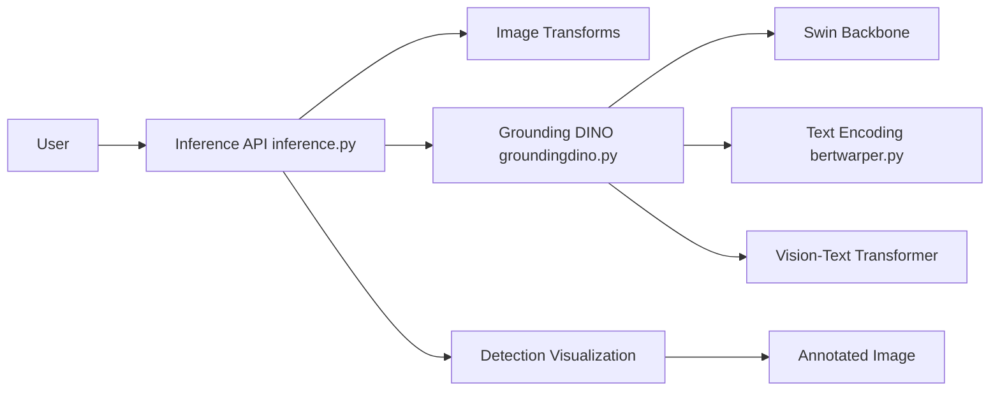

# IDEA-Research/GroundingDINO

> Détecteur d'objets open-set : une image et un texte donnent des boîtes étiquetées par phrase.

## Le problème
Les détecteurs classiques ne reconnaissent que les classes vues à l'entraînement ; annoter un nouveau jeu coûte cher.

## Ce que ça fait vraiment
Prend une paire (image, texte), renvoie 900 boîtes par défaut filtrées par `box_threshold` et `text_threshold`.
Architecture : backbones texte (BERT) et image (Swin), enrichisseur de features, sélection de requêtes guidée par le langage, décodeur cross-modal.
52,5 AP COCO zero-shot annoncé ; checkpoints Swin-T et Swin-B ; démo Gradio, notebooks avec Stable Diffusion et GLIGEN.
Supporté aussi dans Hugging Face Transformers. Code d'entraînement non publié.

## Comment c'est branché


## Essayer
```bash
git clone https://github.com/IDEA-Research/GroundingDINO.git
cd GroundingDINO/
pip install -e .
mkdir weights
cd weights
wget -q https://github.com/IDEA-Research/GroundingDINO/releases/download/v0.1.0-alpha/groundingdino_swint_ogc.pth
cd ..
```

## Coût et pièges
Gratuit. `CUDA_HOME` doit être défini sinon compilation CPU et erreur `_C not defined`. Dernier push août 2024.

## Ce que ce n'est pas
Pas entraînable avec ce dépôt (training codes non publiés). Pas la dernière version : Grounding DINO 1.5 est annoncé séparément.

## Alternatives
- Grounded-SAM / Grounded SAM 2 : si tu veux segmentation et suivi en plus des boîtes.
- Hugging Face Transformers : pour l'utiliser sans compiler les extensions CUDA.

## Pour toi
À surveiller : très utile pour la pré-annotation zero-shot de datasets, mais passe par la version Transformers plutôt que ce dépôt figé depuis 2024.
