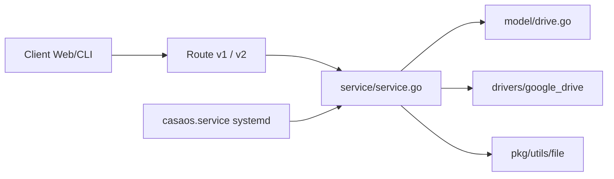

# IceWhaleTech/CasaOS

> Surcouche web de cloud personnel pour installer des apps Docker sur serveur domestique.

## Le problème
Gérer un serveur maison (Nextcloud, Jellyfin, Home Assistant) en ligne de commande rebute les non-techniciens.

## Ce que ça fait vraiment
Service Go installé par script sur Debian, Ubuntu ou Raspberry Pi OS : interface web, magasin d'apps Docker en un clic, gestion de disques et fichiers, widgets de ressources. Pilotes pour Dropbox, Google Drive, OneDrive. API décrite en OpenAPI, service systemd.

## Comment c'est branché


## Essayer
```bash
curl -fsSL https://get.casaos.io | sudo bash
casaos -v
casaos-uninstall
```

## Coût et pièges
Installation par `curl | sudo bash`. Dernier push en août 2025, plus d'un an : maintenance incertaine, 834 issues ouvertes.

## Ce que ce n'est pas
Pas un OS complet ni un orchestrateur ; rien de spécifique à l'IA malgré l'évocation d'un « copilote personnalisé ».

## Alternatives
Aucune nommée dans le README.

## Pour toi
Un cloud personnel pour serveur domestique : utile pour un homelab, sans apport pour une chaîne data ou MLOps. À ignorer.
