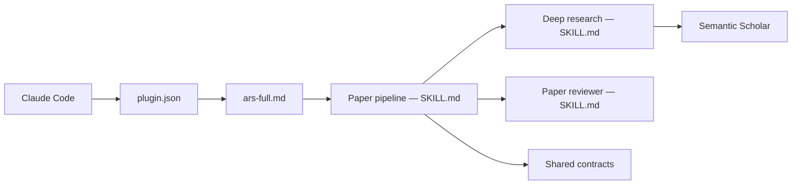

# Imbad0202/academic-research-skills

> Suite de skills Claude Code pour chercheurs : recherche documentaire, rédaction, revue et pipeline de publication.

## Le problème
Les pipelines IA de recherche hallucinent des citations et des résultats ; rien ne force de contrôle humain à chaque étape.

## Ce que ça fait vraiment
Quatre skills : `deep-research`, `academic-paper`, `academic-paper-reviewer`, `academic-pipeline` (10 étapes).
Portes d'intégrité obligatoires (étapes 2.5 et 4.5), « Material Passport » pour la provenance.
Vérification de références via Semantic Scholar, OpenAlex, Crossref ; audit optionnel des affirmations.
Sortie Markdown, DOCX (Pandoc) ou PDF LaTeX (tectonic) ; scripts Python de lint des schémas.

## Comment c'est branché


## Essayer
```bash
# Commandes à taper dans Claude Code, pas dans un shell :
/plugin marketplace add Imbad0202/academic-research-skills
/plugin install academic-research-skills
/ars-plan
```

## Coût et pièges
Clé Anthropic ; environ 4 à 6 $ pour un article de 15 000 mots selon le README. Pandoc/tectonic optionnels.

## Ce que ce n'est pas
N'écrit pas l'article à ta place et ne prouve pas que les expériences ont été faites. Revues non calibrées (`NOT_CALIBRATED`).

## Alternatives
- Imbad0202/academic-research-skills-codex : même contenu empaqueté pour Codex CLI.

## Pour toi
Pertinent si tu rédiges des papiers ; lourd, et gouverné par une seule personne.
