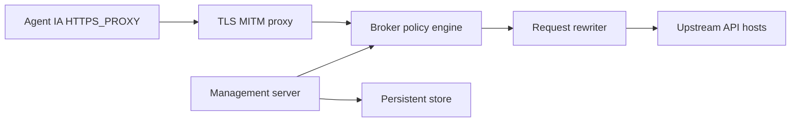

# Infisical/agent-vault

> Courtier d'identifiants Infisical : les agents IA appellent les API sans jamais détenir les vraies clés.

## Le problème
Un agent manipulé par injection de prompt peut divulguer les secrets qu'il possède.

## Ce que ça fait vraiment
Binaire Go unique (serveur et CLI) : un proxy MITM HTTPS sur le port 14322 intercepte les requêtes de l'agent, substitue les valeurs factices (`__anthropic_api_key__`) par les vraies clés, filtre la sortie et journalise. Une API et une interface web sur 14321 gèrent coffres, agents, règles et propositions. Stockage SQLite, ou PostgreSQL en production ; chiffrement par mot de passe maître. Un SDK TypeScript émet des jetons courts.

## Comment c'est branché


## Essayer
```bash
curl --proto '=https' --proto-redir '=https' --tlsv1.2 -fsSL https://get.agent-vault.dev | sh
export AGENT_VAULT_MASTER_PASSWORD=your-password
agent-vault server -d
agent-vault run -- claude
```

## Coût et pièges
À déployer sur une machine distincte des agents ; garder le port proxy privé. Le README annonce un aperçu, API susceptible de changer. Le dossier `ee` requiert une licence Infisical.

## Ce que ce n'est pas
Pas la solution recommandée en production : Infisical conseille Agent Proxy (commercial). Licence non identifiée par GitHub (MIT annoncée, hors `ee`). Le module de télémétrie apparaît dans l'architecture.

## Alternatives
- Infisical Agent Proxy : option commerciale recommandée en production.
- mitmproxy, squid : proxys génériques, à modifier pour ce cas.

## Pour toi
Surveiller : bonne idée pour des agents autonomes avec de vraies clés, mais encore un aperçu.
