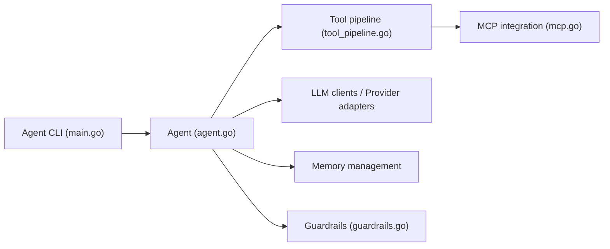

# Ingenimax/agent-sdk-go

> Framework Go pour construire des agents IA avec mémoire, outils, MCP et plusieurs fournisseurs de LLM.

## Le problème
Assembler LLM, mémoire, outils, garde-fous et traçage dans un service Go demande beaucoup de code de liaison.

## Ce que ça fait vraiment
Un agent combine un client LLM (OpenAI, Anthropic, Vertex AI, Azure, Ollama, vLLM), une mémoire (tampon, Redis, vectorielle), des outils et des serveurs MCP. S'y ajoutent sessions persistantes (mémoire, Postgres, SQLite), agents déclarés en YAML, plans d'exécution, patterns multi-agents, évaluation et un CLI `agent-cli`. Comptage des tokens intégré.

## Comment c'est branché


## Essayer
```bash
go get github.com/Ingenimax/agent-sdk-go
go install github.com/Ingenimax/agent-sdk-go/cmd/agent-cli@latest
agent-cli init
export OPENAI_API_KEY=your_api_key_here
agent-cli run "What's the weather in San Francisco?"
```

## Coût et pièges
Go 1.26+ ; clé du fournisseur choisi à votre charge ; Redis optionnel. Le README signale qu'un correctif a retiré le chargement de configuration distante (il pouvait exécuter des binaires locaux) et réparé les garde-fous d'entrée, sans effet quand la mémoire était configurée : lire `docs/upgrading.md` avant de migrer.

## Ce que ce n'est pas
Pas un service prêt à l'emploi : c'est une bibliothèque. La FAQ dit de « vérifier la licence » alors que le catalogue indique MIT. Le drapeau `--dangerously-skip-permissions` du CLI est à manier avec soin.

## Alternatives
Aucune alternative citée dans le README.

## Pour toi
À surveiller si ton équipe écrit ses agents en Go : couverture large et activité récente, mais les bugs de sécurité corrigés rappellent de relire le guide de mise à niveau.
