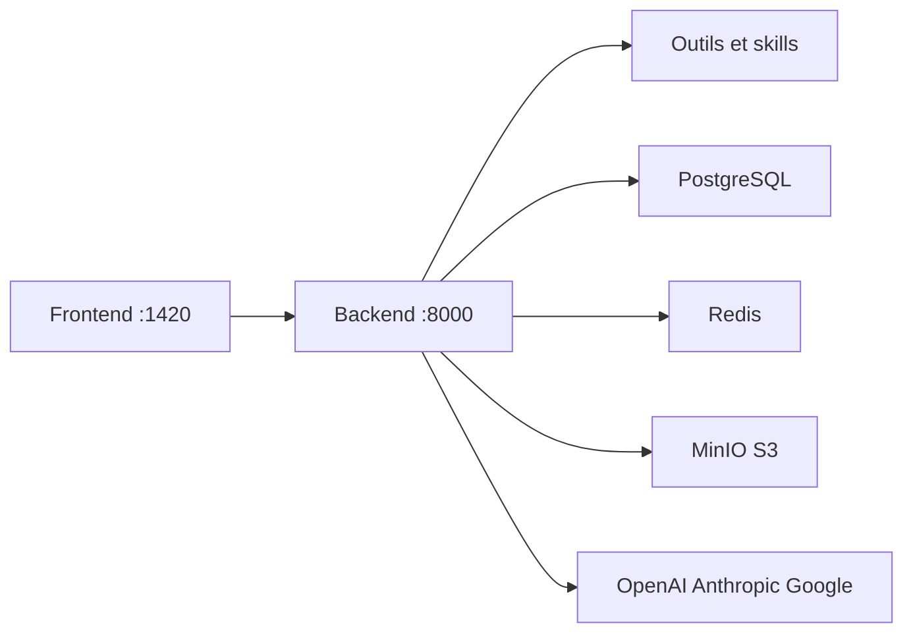

# Intelligent-Internet/ii-agent

> Agent généraliste ouvert (recherche, sites, slides, documents) que l'on héberge avec ses propres clés de LLM.

## Le problème
Les agents « tout-en-un » sont souvent fermés ; on veut en garder le contrôle et choisir son fournisseur de modèle.

## Ce que ça fait vraiment
Interface et backend (port 8000, front 1420) avec PostgreSQL, Redis et MinIO. L'agent planifie en plusieurs étapes, mène des recherches rapides ou approfondies, génère sites, applications mobiles, diaporamas, livres illustrés, images et vidéos, manipule PDF, Excel, Word et PowerPoint. Skills, intégrations (Gmail, Slack, GitHub, Notion…) et chat multi-modèles sont proposés. Les modèles se déclarent dans `model_configs.yaml` ou `MODEL_CONFIGS`.

## Comment c'est branché


## Essayer
```bash
git clone https://github.com/Intelligent-Internet/ii-agent.git
cd ii-agent
make setup
make dev-all
make stack
```

## Coût et pièges
Docker, `uv` et Node requis ; au moins une clé de fournisseur de LLM à ta charge. Identifiants MinIO par défaut (`minioadmin`) à changer. L'architecture générée décrit une version antérieure (`cli.py`, `ws_server.py`) qui ne correspond pas au démarrage par `make` du README.

## Ce que ce n'est pas
Pas un simple assistant de chat : la pile est lourde. Les capacités listées sont celles du README, sans évaluation indépendante.

## Alternatives
Aucune alternative n'est citée dans le README.

## Pour toi
À surveiller : ouvert et BYOK, mais pile lourde et très large ; à essayer sur un cas précis avant de s'y engager.
