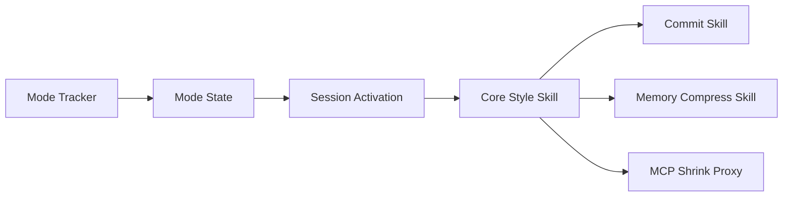

# InterfaceX-co-jp/genshijin

> Plugin Claude Code et Codex qui compresse les réponses en japonais pour réduire la consommation de tokens.

## Le problème
Les réponses en japonais sont pleines de formules de politesse, qui consomment des tokens de sortie sans valeur technique.

## Ce que ça fait vraiment
Un skill impose trois niveaux de style télégraphique (poli, normal, extrême) via des hooks de démarrage et de saisie qui réinjectent les règles à chaque tour. Des sous-skills produisent des commits et des revues de PR, compressent les fichiers mémoire (`CLAUDE.md`) avec sauvegarde, affichent les statistiques de tokens et fournissent trois sous-agents. Un proxy MCP raccourcit les descriptions d'outils, et des règles existent pour Cursor, Windsurf, Cline et Copilot.

## Comment c'est branché


## Essayer
```bash
/plugin install genshijin
npx skills add InterfaceX-co-jp/genshijin
/genshijin-compress ~/.claude/CLAUDE.md
```

## Coût et pièges
Gratuit ; la compression de mémoire demande Python 3.10+ et soit `ANTHROPIC_API_KEY` soit le CLI claude connecté. Elle écrase le fichier cible (sauvegarde `CLAUDE.original.md`). Le hook écrit un fichier d'état dans `~/.claude`.

## Ce que ce n'est pas
Les gains chiffrés (83 % en moyenne) viennent de benchmarks maison, non indépendants ; en anglais l'avantage sur caveman est faible (7 %). Pas prévu pour une lecture humaine détaillée.

## Alternatives
Le README cite caveman (JuliusBrussee/caveman), version anglaise d'origine.

## Pour toi
Surveiller : peu coûteux à tester si tu échanges en japonais avec un agent ; l'intérêt est nul en français, et les chiffres restent auto-déclarés.
