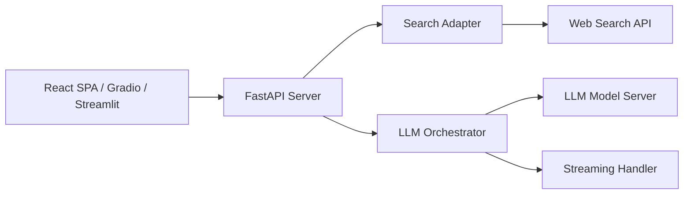

# InternLM/MindSearch

> Moteur de recherche web à base d'agents LLM, avec backend FastAPI et plusieurs frontends.

## Le problème
Une seule requête web + LLM rate les questions complexes qui demandent de décomposer et croiser plusieurs recherches.

## Ce que ça fait vraiment
Un agent (framework Lagent) décompose la question en sous-requêtes lancées en parallèle sur un moteur web (DuckDuckGo, Bing, Brave, Google Serper, Tencent).
Les résultats sont agrégés par un LLM (InternLM2.5-7b local ou GPT-4) et restitués en flux.
Frontends React, Gradio ou Streamlit ; script `backend_example.py` pour usage direct.
Dernier push en juillet 2025.

## Comment c'est branché


## Essayer
```bash
git clone https://github.com/InternLM/MindSearch
cd MindSearch
pip install -r requirements.txt
mv .env.example .env
python -m mindsearch.app --lang en --model_format internlm_server --search_engine DuckDuckGoSearch --asy
python -m mindsearch.terminal
```

## Coût et pièges
Clé API du moteur de recherche (sauf DuckDuckGo) ; GPU pour InternLM local ou clé OpenAI.
Projet non mis à jour depuis plus d'un an.

## Ce que ce n'est pas
Pas un produit maintenu : démonstrateur de recherche associé à un papier.
Pas optimisé pour d'autres modèles sans modifier le code.

## Alternatives
- Lagent : le framework d'agents sous-jacent, si tu veux construire le tien.

## Pour toi
À ignorer : idée de recherche parallèle intéressante mais projet figé ; les solutions de deep research actuelles vont plus loin.
