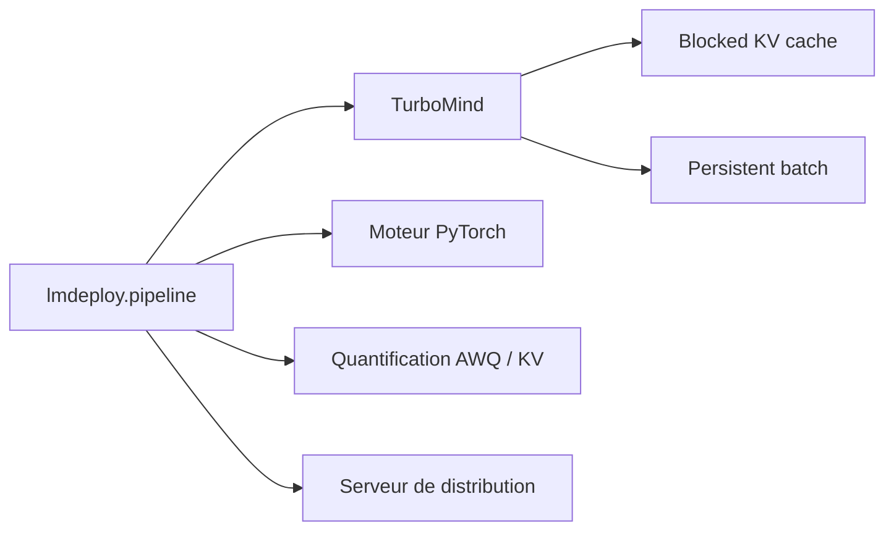

# InternLM/lmdeploy

> Boîte à outils pour compresser, quantifier et servir des LLM sur GPU, signée MMRazor/MMDeploy.

## Le problème
Servir un LLM avec un débit correct suppose batch continu, cache KV par blocs, parallélisme
tensoriel et quantification — chacun étant un chantier séparé si on les recode.

## Ce que ça fait vraiment
Deux moteurs d'inférence (TurboMind et PyTorch) derrière une même API `pipeline()`. Batch
persistant, cache KV bloqué, split&fuse dynamique, noyaux CUDA maison. Quantification
weight-only et k/v, avec AWQ et préfixe automatique utilisables en même temps. Service de
distribution de requêtes pour déployer plusieurs modèles sur plusieurs machines et cartes.

## Comment c'est branché


## Essayer
```bash
conda create -n lmdeploy python=3.12 -y
conda activate lmdeploy
pip install lmdeploy
pip install modelscope
export LMDEPLOY_USE_MODELSCOPE=True
```

## Coût et pièges
Gratuit, mais GPU obligatoire. Python 3.10–3.13. Depuis la v0.13.0 les roues PyPI sont compilées
pour CUDA 12.8 : une autre version de CUDA demande une installation manuelle. Par défaut les
poids sont tirés de HuggingFace, sauf variable d'environnement vers ModelScope ou openMind Hub.

## Ce que ce n'est pas
Ce n'est pas un framework d'entraînement ni de fine-tuning. Les gains annoncés (1,8× vLLM,
2,4× en 4 bits) viennent du README, pas d'une mesure indépendante.

## Alternatives
- **vLLM** : cité comme point de comparaison ; écosystème plus large, intégrations plus nombreuses.
- **BentoLMDeploy** : cité en projet tiers, pour empaqueter le service avec BentoML.

## Pour toi
Le bon choix si tu sers des modèles InternLM/Qwen sur ton propre GPU et que le débit compte.
