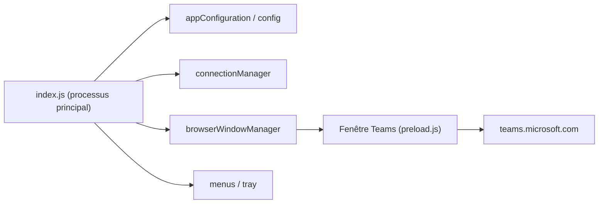

# IsmaelMartinez/teams-for-linux

> Client Microsoft Teams non officiel pour Linux, enveloppe Electron autour de la version web.

## Le problème
Pas de client Teams officiel maintenu sur Linux, avec notifications et zone de notification intégrées.

## Ce que ça fait vraiment
Application Electron qui charge le Teams web et ajoute notifications système, icône de zone de notification, arrière-plans et thèmes personnalisés, partage d'écran, profils multiples. Modules du processus principal : configuration, gestionnaire de connexion, certificats, CSS personnalisé, correcteur orthographique, Intune optionnel, menus. Paquets : AppImage, deb, rpm, snap, tar.gz.

## Comment c'est branché


## Essayer
```bash
teams-for-linux
# configuration facultative : ~/.config/teams-for-linux/config.json
```

## Coût et pièges
Gratuit ; compte Microsoft Teams requis. Le README indique que `contextIsolation` et le bac à sable d'Electron sont désactivés pour accéder au DOM de Teams, et conseille un bac à sable système (Flatpak, Snap, Firejail, AppArmor).

## Ce que ce n'est pas
Projet indépendant, non affilié à Microsoft ; certaines fonctions sont limitées par l'application web de Teams.

## Alternatives
Aucune alternative nommée dans le README.

## Pour toi
À ignorer côté data/IA : utile seulement si tu es sous Linux et contraint d'utiliser Teams, avec un réglage de sécurité affaibli à compenser.

