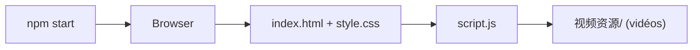

# Jackywine/Bella

> Prototype web de compagnon IA vocal avec vidéos animées, encore largement à l'état de vision.

## Le problème
Créer un compagnon numérique conversationnel qui écoute et exprime des émotions.

## Ce que ça fait vraiment
Le README annonce reconnaissance vocale Whisper, dialogue LLM, TTS, système d'affinité et téléchargement de modèles. L'architecture tirée du code ne voit qu'une interface statique : carrousel de vidéos et barre de « faveur » (index.html, script.js, style.css), sans backend IA. Mémoire, personnalité et perception faciale sont « planifiées ».

## Comment c'est branché


## Essayer
```bash
git clone https://github.com/GRISHM7890/Bella.git
cd Bella
npm install
npm run download
npm start
```

## Coût et pièges
Node 22.16+, navigateur avec Web Speech API, micro. Modèles à télécharger (taille non précisée). Le README clone `GRISHM7890/Bella`, pas ce dépôt : incohérence à vérifier.

## Ce que ce n'est pas
Pas un compagnon IA fonctionnel : l'écart entre README et code est net. Sans licence.

## Alternatives
Aucune nommée dans le README.

## Pour toi
À ignorer : promesses non démontrées par le code, licence absente, URL de clonage incohérente.

