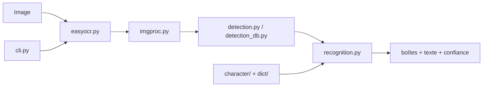

# JaidedAI/EasyOCR

> Bibliothèque Python d'OCR (détection puis reconnaissance de texte) sur 80+ langues, pour développeurs data.

## Le problème
Extraire du texte d'images dans des alphabets variés (latin, chinois, arabe, cyrillique…) demande d'assembler soi-même détecteur, reconnaisseur et vocabulaires.

## Ce que ça fait vraiment
Pipeline en deux étages : détection de zones de texte (CRAFT ou DBNet) puis reconnaissance CRNN avec décodage CTC.
`easyocr.Reader([...])` charge les modèles une fois ; `readtext()` renvoie boîtes, texte et confiance.
Poids téléchargés automatiquement dans `~/.EasyOCR/model` ; mode CPU via `gpu=False`.
Un sous-dossier `trainer/` permet d'entraîner ou affiner détecteur et reconnaisseur.

## Comment c'est branché


## Essayer
```bash
pip install easyocr
easyocr -l ch_sim en -f chinese.jpg --detail=1 --gpu=True
```

## Coût et pièges
Gratuit ; GPU conseillé mais optionnel. Sous Windows, installer torch/torchvision d'abord ; certains modèles DBNet demandent une compilation native.

## Ce que ce n'est pas
Pas d'écriture manuscrite (annoncée « à venir »). Toutes les langues ne se combinent pas dans un même `Reader`. Issues de plus de 6 mois fermées automatiquement.

## Alternatives
Aucune alternative nommée dans le README.

## Pour toi
Adopter : c'est l'OCR multilingue le plus simple à brancher dans un pipeline Python, sous Apache-2.0, avec une voie d'entraînement si tes documents sortent du commun.
