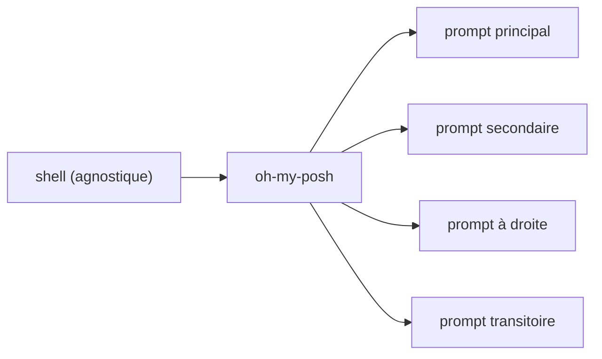

# JanDeDobbeleer/oh-my-posh

> Moteur de thèmes de prompt, annoncé comme indépendant du shell et de la plateforme.

## Le problème
Un prompt de terminal utile (branche git, contexte cloud, durée de commande) se bricole shell par
shell, et le travail est à refaire dès qu'on change de machine ou de shell.

## Ce que ça fait vraiment
Le README tel que fourni ne contient qu'une liste de caractéristiques : agnostique au shell et à la
plateforme, configurable, rapide, prompt secondaire, prompt à droite, prompt transitoire. Les
sections « Documentation » et « Reviews » sont vides de contenu, hors un lien vers une revue par
TameWizard. Aucune description du format de configuration ni du mécanisme de thème n'est donnée ici.

## Comment c'est branché

## Essayer
Aucune commande d'installation n'est documentée dans ce README.

## Coût et pièges
Rien n'est indiqué : ni licence, ni prérequis, ni dépendance. Le README renvoie à une documentation
externe qui n'est pas reproduite ici.

## Ce que ce n'est pas
Pas un shell ni un framework de configuration de shell : il ne gère que l'affichage du prompt.
Pas documenté dans ce fichier — toute décision d'adoption suppose d'aller lire le site du projet.
La mention « le plus configurable » est une revendication du README, non un fait vérifiable ici.

## Alternatives
Aucune alternative n'est nommée dans le README.

## Pour toi
Confort de terminal, sans effet sur ton travail data ; à regarder un jour de rangement de poste.
