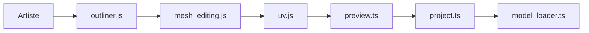

# JannisX11/blockbench

> Éditeur 3D gratuit pour modèles low-poly à textures pixel art, avec formats Minecraft.

## Le problème
Créer des modèles low-poly texturés pour jeux ou Minecraft demande des outils 3D lourds, peu adaptés au pixel art.

## Ce que ça fait vraiment
Éditeur de bureau (Electron) et web : hiérarchie de modèle (outliner), édition de maillage, UV, peinture de textures, animation (timeline), aperçu 3D. Export vers des formats standardisés (glTF) et dédiés Minecraft Java et Bedrock. Système de plugins en JavaScript.

## Comment c'est branché


## Essayer
```bash
npm install
npm run dev
npm run serve   # version web sur http://localhost:3000
```

## Coût et pièges
Gratuit. Le README recommande de télécharger l'application sur le site plutôt que compiler. 665 issues ouvertes.

## Ce que ce n'est pas
Pas un outil de modélisation haut de gamme ni de génération par IA : un éditeur manuel de modèles à cubes et pixels.

## Alternatives
Aucune alternative nommée dans le README.

## Pour toi
Ignorer : outil de création 3D pour jeux, hors de ton périmètre, sauf besoin ponctuel d'assets.

