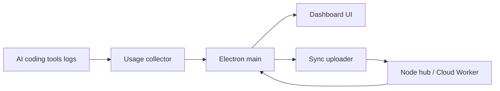

# Javis603/token-monitor

> Widget de bureau affichant l'usage de tokens et les limites de plus de 37 outils de code IA, multi-appareils.

## Le problème
L'usage de tokens et les quotas sont dispersés entre outils (Claude Code, Codex, Cursor, Copilot…) et machines.

## Ce que ça fait vraiment
Une application Electron lit localement les journaux des outils (via tokscale) et affiche coûts, tokens, taux de cache, limites par fournisseur, tendances et carte d'activité annuelle. Une synchronisation multi-appareils optionnelle passe par un hub (dans le widget, en Node ou sur Cloudflare Worker), avec Server-Sent Events. Menus de barre, widgets macOS, export CSV/JSON, comptes multiples.

## Comment c'est branché


## Essayer
```bash
brew install --cask token-monitor
```
Ou construire : `npm install` puis `npm run dist:linux`. Hub Node : `cp .env.example .env` puis `npm run hub`.

## Coût et pièges
Gratuit. Mode local par défaut sans configuration. La lecture des limites demande des identifiants de fournisseurs. Claude Code n'archive que 30 jours de transcriptions par défaut ; l'option de conservation est fournie.

## Ce que ce n'est pas
Pas un optimiseur de tokens : il mesure seulement. Le README annonce aucune télémétrie vers le mainteneur ; le réseau n'est utilisé que pour les fonctions activées.

## Alternatives
- tokscale et CodexBar : cités comme briques d'analyse et d'inspiration.

## Pour toi
Adopter si tu jongles entre plusieurs outils de code IA : vue unique du coût et des quotas, données restant en local.
