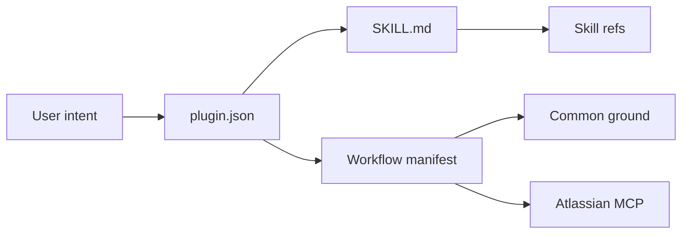

# Jeffallan/claude-skills

> Plugin Claude Code regroupant 67 skills de développement et des commandes de workflow projet.

## Le problème
Claude Code manque de guides spécialisés par framework et de processus de projet reproductibles, à réécrire à chaque dépôt.

## Ce que ça fait vraiment
67 skills en 12 catégories (langages, frameworks, infra, tests, DevOps, sécurité, data/ML), chacun un `SKILL.md` plus des références chargées selon la demande.
Enchaînements proposés (ex. Feature Forge → Architecture Designer → Test Master).
9 commandes de workflow (intake, discovery, planning, exécution, rétrospective) reliées à Jira/Confluence.
`/common-ground` pour faire expliciter les hypothèses de Claude sur ton projet.

## Comment c'est branché


## Essayer
```bash
/plugin marketplace add jeffallan/claude-skills
/plugin install fullstack-dev-skills@jeffallan
```

## Coût et pièges
Gratuit ; les commandes de workflow exigent un serveur MCP Atlassian (Jira/Confluence).
Beaucoup de skills chargés peuvent polluer le contexte.

## Ce que ce n'est pas
Pas du code exécutable : c'est de la connaissance rédigée, sa qualité dépend de chaque fichier.
Pas un produit officiel Anthropic.

## Alternatives
Aucune alternative nommée dans le README.

## Pour toi
À surveiller : à piocher skill par skill (notamment data/ML) plutôt qu'à installer en bloc, et utile comme modèle d'organisation de tes propres skills.
