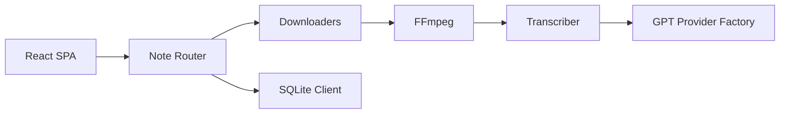

# JefferyHcool/BiliNote

> Assistant open source qui transforme des vidéos (Bilibili, YouTube…) en notes Markdown.

## Le problème
Prendre des notes structurées sur une longue vidéo prend autant de temps que la regarder.

## Ce que ça fait vraiment
Il télécharge la vidéo (Bilibili, YouTube, Douyin, Kuaishou, fichier local) ou récupère les sous-titres.
Transcription locale (Faster-Whisper, MLX-Whisper) ou distante (Groq, BCut), puis résumé par LLM en Markdown.
Captures d'écran, liens horodatés vers la vidéo, questions-réponses RAG sur la note.
Backend FastAPI + SQLite, front React, extension navigateur, client de bureau Tauri.

## Comment c'est branché


## Essayer
```bash
docker pull ghcr.io/jefferyhcool/bilinote:latest
docker run -d -p 80:80 -v bilinote-data:/app/backend/data --name bilinote ghcr.io/jefferyhcool/bilinote:latest
```

## Coût et pièges
Clé LLM à ta charge ; GPU optionnel pour Whisper. Le modèle Whisper peut provoquer un OOM au premier lancement (d'où `tiny` par défaut).

## Ce que ce n'est pas
Pas seulement open source : une version Pro hébergée et des services payants sont mis en avant. L'export PDF, Word ou Notion n'existe pas encore.

## Alternatives
Aucune alternative nommée dans le README.

## Pour toi
À surveiller : le pipeline vidéo → transcription → LLM → RAG est un bon modèle de référence, proche de ton skill `watch-md`.
