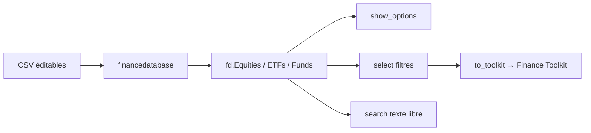

# JerBouma/FinanceDatabase

> Base de 300 000+ symboles financiers catégorisés, interrogeable depuis Python.

## Le problème
Trouver quels instruments existent dans un secteur, un pays ou une industrie est impossible sans catalogue : on ne connaît que les tickers déjà célèbres.

## Ce que ça fait vraiment
Fournit 112 707 actions, 36 481 ETF, 57 853 fonds, 2 556 devises, 3 367 cryptos, 91 181 indices, 1 367 money markets.
`select()` filtre par pays, secteur, industrie, bourse, marché ; `show_options()` liste les valeurs possibles sans charger les gros fichiers.
`search()` cherche une chaîne dans n'importe quelle colonne, y compris le résumé, avec ou sans sensibilité à la casse.
`to_toolkit()` bascule une sélection vers le Finance Toolkit pour l'analyse financière.

## Comment c'est branché


## Essayer
```python
import financedatabase as fd
equities = fd.Equities()
equities.select(country='Netherlands', industry='Insurance')
fd.show_options("equities")
```

## Coût et pièges
La base elle-même est gratuite. `to_toolkit()` demande une clé API FinancialModelingPrep, à ta charge. Chaque classe d'actifs se charge une fois : garder l'objet en variable, sinon chaque requête recharge tout.

## Ce que ce n'est pas
Explicitement pas une source de fondamentaux ni de cours : uniquement la catégorisation des produits. Les données viennent de CSV maintenus à la main par la communauté, donc datées et perfectibles. Un même émetteur apparaît plusieurs fois, une par place de cotation, sauf `only_primary_listing` ou filtre de marché.

## Alternatives
Finance Toolkit — cité dans le README comme le complément qui fournit les données financières que cette base ne couvre pas.

## Pour toi
Utile comme référentiel de départ pour un pipeline finance ; à traiter comme une donnée de catalogue, pas comme une vérité de marché.
