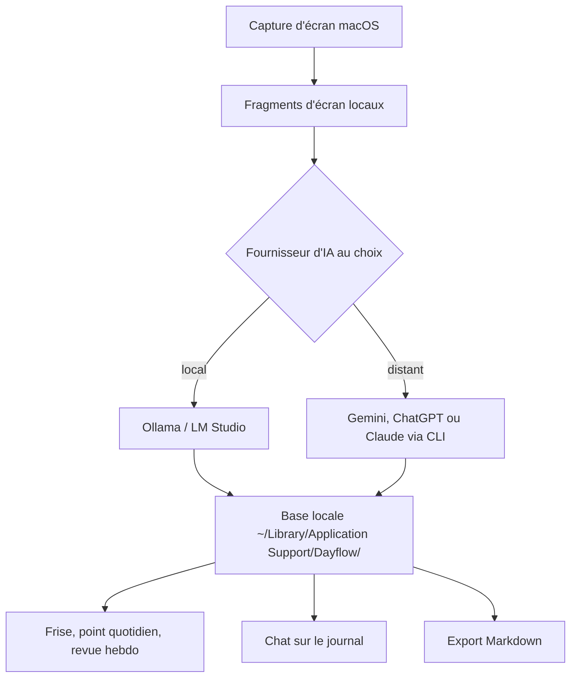

# JerryZLiu/Dayflow

> **One sentence.** A macOS app that records the screen and rebuilds the workday as an annotated timeline.

## The problem

Reconstructing a workday means either running timers by hand or writing notes afterwards, and nobody actually does it.
Classic time trackers only report which app was open: two hours in Cursor cannot tell a shipped feature from a botched setup.

## What it actually does

- Captures lightweight screen chunks on the Mac, sends them to the AI provider you picked, and turns them into dated activity cards.
- Builds a chronological timeline from what was on screen, not just from the active window title.
- Prepares a daily standup: a GitHub-style activity grid, yesterday's highlights, today's priorities and blockers.
- Answers natural-language questions about your day, week or year, grounded in the stored timeline.
- Aggregates the week into focus patterns, categories, app usage and interaction graphs, and flags sessions it considers distracting.
- Exports the timeline as Markdown for a date range, and purges old recordings automatically once a storage limit is set.

## How it is wired

Everything stays on the Mac; only the analysis call leaves the machine, and only when the chosen provider is remote.



## Trying it

```bash
brew install --cask dayflow
git clone https://github.com/JerryZLiu/Dayflow.git
cd Dayflow
open Dayflow/Dayflow.xcodeproj
```

The README otherwise points to downloading `Dayflow.dmg` from GitHub Releases and dragging it into Applications.

## Cost and gotchas

macOS 14 or newer, plus the "Screen & System Audio Recording" permission: none of this runs anywhere but a recent Mac.
You bring your own AI provider: a Gemini API key, ChatGPT or Claude through their local CLI tools, or Ollama / LM Studio locally. Remote provider bills are on you, and the README states that the activity data needed for analysis is sent to that provider.
Continuous recording fills the disk; automatic cleanup exists but has to be configured. The project site links a "Pricing" page the README says nothing about.

## What it is not

Not a per-project time tracker or a billing tool: it describes what happened, it does not allocate hours to clients.
Not cross-platform: macOS only, with no Windows or Linux build mentioned in the README.
"Local-first" does not mean offline: as soon as Gemini or ChatGPT is wired in, screen content goes to them.

## Alternatives

No comparable alternative in the catalogue. The suggested neighbours address other needs: `basicmachines-co/basic-memory` is a hand-written knowledge base, `Renset/macai` a Mac LLM chat client, `hydropix/TranslateBooksWithLLMs` a book translator and `h2oai/h2ogpt` a document RAG stack — none of them captures the screen or reconstructs a workday.

## For you

Little technical value for a data or MLOps stack: this is a personal work-journal app, not a component to integrate. Worth a look if you live on a Mac and are tired of reconstructing sprint reports from memory — provided you accept being screen-recorded all day.
