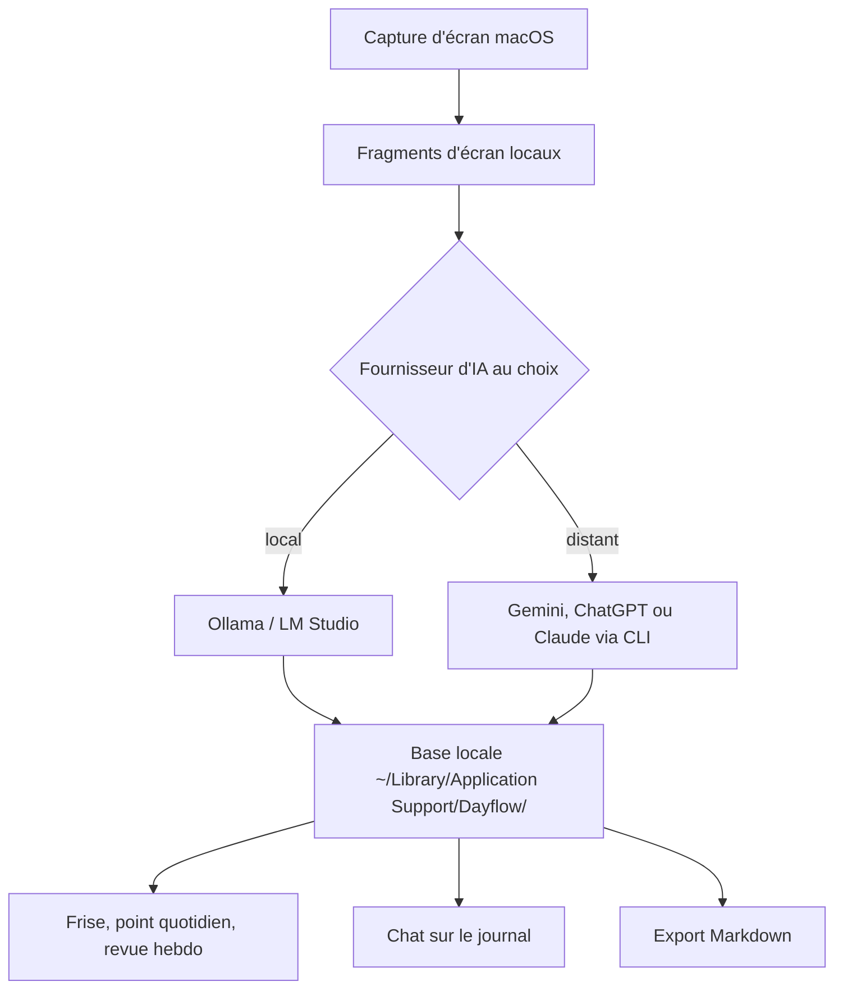

# JerryZLiu/Dayflow

> **Une phrase.** Application macOS qui filme l'écran et reconstitue la journée de travail en frise commentée.

## Le problème

Reconstituer sa journée suppose des minuteurs lancés à la main ou des notes prises après coup, et personne ne le fait.
Les traceurs de temps classiques ne disent que quelle application était ouverte : deux heures dans Cursor ne distinguent pas une fonctionnalité livrée d'une configuration ratée.

## Ce que ça fait vraiment

- Capture des fragments d'écran en continu sur le Mac, puis les fait analyser par le fournisseur d'IA choisi et les transforme en cartes d'activité datées.
- Construit une frise chronologique de la journée à partir du contenu affiché, pas seulement du titre de la fenêtre active.
- Prépare un point quotidien : grille d'activité façon GitHub, faits marquants de la veille, priorités du jour, points de blocage.
- Répond en langage naturel à des questions sur la journée, la semaine ou l'année, en s'appuyant sur la frise enregistrée.
- Agrège la semaine en périodes de concentration, catégories, usage par application et graphes d'interaction ; signale les sessions identifiées comme distrayantes.
- Exporte la frise en Markdown sur une plage de dates, et purge automatiquement les anciens enregistrements selon une limite de stockage configurée.

## Comment c'est branché

Tout reste sur le Mac ; seul l'appel d'analyse sort de la machine, et uniquement si le fournisseur choisi est distant.



## Essayer

```bash
brew install --cask dayflow
git clone https://github.com/JerryZLiu/Dayflow.git
cd Dayflow
open Dayflow/Dayflow.xcodeproj
```

Le README propose sinon le téléchargement du `Dayflow.dmg` depuis les releases GitHub, puis le glisser dans Applications.

## Coût et pièges

macOS 14 minimum et autorisation « Screen & System Audio Recording » à accorder : rien de tout cela ne tourne ailleurs que sur un Mac récent.
Le fournisseur d'IA est à fournir soi-même : clé d'API Gemini, ChatGPT ou Claude via leurs CLI locales, ou bien Ollama / LM Studio en local. La facture des fournisseurs distants est à ta charge, et le README précise que les données d'activité nécessaires à l'analyse leur sont envoyées.
L'enregistrement continu remplit le disque : la purge automatique existe mais se configure. Le site du projet affiche une page « Pricing » dont le README ne dit rien.

## Ce que ce n'est pas

Ce n'est pas un traceur de temps par projet ni un outil de facturation : il décrit ce qui s'est passé, il ne ventile pas des heures sur des clients.
Ce n'est pas un service multiplateforme : macOS uniquement, pas de version Windows ni Linux dans le README.
« Local-first » ne veut pas dire hors ligne : dès qu'on branche Gemini ou ChatGPT, le contenu de l'écran part chez eux.

## Alternatives

Aucune alternative comparable dans le catalogue. Les voisins proposés relèvent d'autres besoins : `basicmachines-co/basic-memory` est une base de connaissance rédigée à la main, `Renset/macai` un client de chat LLM pour Mac, `hydropix/TranslateBooksWithLLMs` un traducteur de livres et `h2oai/h2ogpt` une pile RAG documentaire — aucun ne capture l'écran ni ne reconstruit une journée de travail.

## Pour toi

Peu d'intérêt technique pour une pile data ou MLOps : c'est un outil personnel de journal de travail, pas une brique à intégrer. À regarder si tu passes ta journée sur un Mac et que tu en as assez de reconstituer tes comptes rendus de sprint de mémoire — en acceptant que ton écran soit filmé en permanence.
