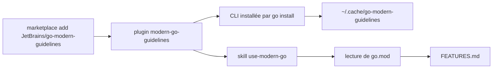

# JetBrains/go-modern-guidelines

> Consignes qui poussent un agent de code à écrire du Go moderne plutôt que daté.

## Le problème
Les agents génèrent du Go d'il y a cinq ans : boucles manuelles, chaînes de vérifications nil, `for i := 0`.
Deux causes : la coupure des données d'entraînement et le biais de fréquence.

## Ce que ça fait vraiment
Fournit une référence explicite des fonctionnalités de Go 1.0 à 1.27, dont tout ce que vise l'analyseur `modernize`.
L'agent détecte la version du projet dans `go.mod` et n'utilise que ce qui est disponible jusqu'à celle-ci.
Résultat attendu : `max(a, b)`, `slices.Contains`, `cmp.Or(a, b, c)`, `new(42)`, `errors.AsType[T]`.
`FEATURES.md` porte la liste complète avec descriptions et exemples.

## Comment c'est branché


## Essayer
```
/plugin marketplace add JetBrains/go-modern-guidelines
/plugin install modern-go-guidelines@goland-claude-marketplace
```

## Coût et pièges
Gratuit, mais la chaîne Go doit être installée et dans le `PATH` : la CLI s'installe par `go install`.
Elle vise Go 1.25 ou plus récent ; sur plus ancien elle dépend du basculement automatique `GOTOOLCHAIN=auto`.

## Ce que ce n'est pas
Pas un linter : il oriente l'écriture, il ne corrige pas le code existant — c'est le rôle de `modernize`.
Pas un outil hors agent : sans agent de code, la valeur est celle d'un document à lire.
Pas neutre d'installation : il télécharge et exécute un binaire depuis son cache.

## Alternatives
L'analyseur `modernize` de l'équipe Go, pour mettre à jour du code déjà écrit.

## Pour toi
Sans objet si tu ne fais pas de Go ; le modèle « consignes versionnées pour agent » est en revanche à reprendre.
