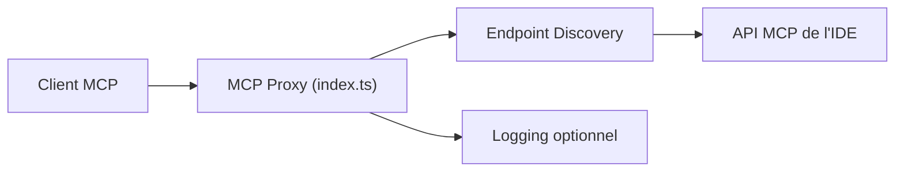

# JetBrains/mcp-jetbrains

> Proxy MCP npm vers les IDE JetBrains, déprécié depuis l'intégration native dans les IDE 2025.2.

## Le problème
Un client MCP (Claude Desktop, VS Code) voulait accéder aux outils d'un IDE JetBrains.

## Ce que ça fait vraiment
Petit proxy Node (`@jetbrains/mcp-proxy`) qui découvre et rafraîchit l'endpoint de l'IDE, liste les outils et relaie appels et résultats en stdio. Nécessite le plugin « MCP Server » ; réglages `IDE_PORT`, `HOST`, `LOG_ENABLED`. Le README indique que le dépôt n'est plus maintenu.

## Comment c'est branché


## Essayer
```json
{
  "mcpServers": {
    "jetbrains": {
      "command": "npx",
      "args": ["-y", "@jetbrains/mcp-proxy"]
    }
  }
}
```

## Coût et pièges
Node 18+ (Node 16 échoue). Sur macOS avec nvm, il faut un lien symbolique de `npx` dans `/usr/local/bin`. Le dépôt n'est pas archivé mais annoncé non maintenu.

## Ce que ce n'est pas
Plus la voie recommandée : le serveur MCP intégré aux IDE JetBrains (SSE ou proxy JVM) le remplace.

## Alternatives
La fonctionnalité intégrée aux IDE IntelliJ 2025.2+, citée par le README.

## Pour toi
À ignorer : dépôt déprécié ; utilise le MCP natif de l'IDE JetBrains.
