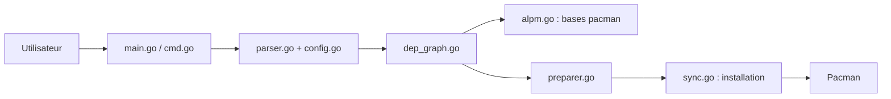

# Jguer/yay

> Assistant en ligne de commande pour installer et mettre à jour les paquets Arch Linux, dépôts officiels et AUR.

## Le problème
Sur Arch, installer un paquet de l'AUR oblige à cloner le PKGBUILD, résoudre les dépendances et lancer makepkg à la main.

## Ce que ça fait vraiment
Résout les dépendances d'avance, télécharge les PKGBUILD (ABS ou AUR), pose toutes les questions avant de lancer les builds, puis installe via pacman. Gère aussi les paquets `-git` (base de hachages de développement), la recherche progressive, le vote AUR et le nettoyage des dépendances de build.

## Comment c'est branché


## Essayer
```bash
sudo pacman -S --needed git base-devel
git clone https://aur.archlinux.org/yay.git
cd yay
makepkg -si
yay -Syu --devel
```

## Coût et pièges
Gratuit. Il exécute des PKGBUILD de l'AUR : les relire reste ta responsabilité. Voter exige `AUR_USERNAME` et `AUR_PASSWORD` en variables d'environnement.

## Ce que ce n'est pas
Pas un outil multi-distribution : il ne sert qu'avec pacman. Les problèmes causés en éditant un PKGBUILD pendant l'installation ne sont pas pris en charge.

## Alternatives
- paru : autre assistant AUR cité dans le README.
- aurutils : approche plus modulaire.
- pikaur : autre assistant AUR.

## Pour toi
À ignorer pour la veille data/IA : c'est de la gestion de paquets Arch, utile seulement si ta machine de travail tourne sous Arch.

