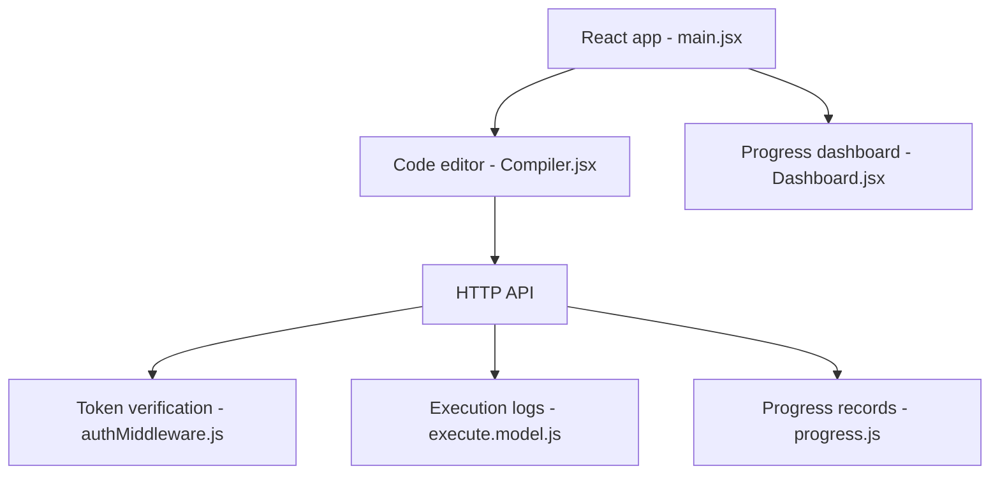

# JiyaBatra/CODEVIBE-

> Plateforme web d'apprentissage du code (C, HTML, CSS, SQL) avec éditeur en ligne, évaluation et certificats, pour débutants.

## Le problème
Apprendre à programmer sans installer d'environnement local, avec correction instantanée.

## Ce que ça fait vraiment
Frontend React et backend Node/Express avec MongoDB : cours structurés, éditeur-compilateur, évaluation (100 points par solution correcte), tableau de bord de progression, examens QCM, certificats et un tableau « My Mistakes » qui classe les erreurs récurrentes. Le README liste aussi des routes d'API (auth, leçons, compilation, progression).

## Comment c'est branché


## Essayer
```bash
cd client && npm install
cd ../server && npm install
cp server/.env.example server/.env
cd server && npm run dev
cd client && npm run dev
docker-compose up --build
```

## Coût et pièges
Node 16+, MongoDB (local ou Atlas) et un `JWT_SECRET` à générer. Le README est inégal : il cite SQL injection prevention alors que le backend est MongoDB, et la commande `git clone` du bloc Docker est incomplète.

## Ce que ce n'est pas
Pas un produit éprouvé : v1.0.0, nombreuses fonctions encore en projet (collaboration, hints IA, mentors). Rien ne dit comment le code utilisateur est exécuté en sécurité.

## Alternatives
Le README ne cite que FreeCodeCamp comme inspiration, sans en faire une alternative.

## Pour toi
À ignorer : projet pédagogique débutant, sans lien avec la donnée ou l'IA, et sa sécurité d'exécution de code n'est pas documentée.

