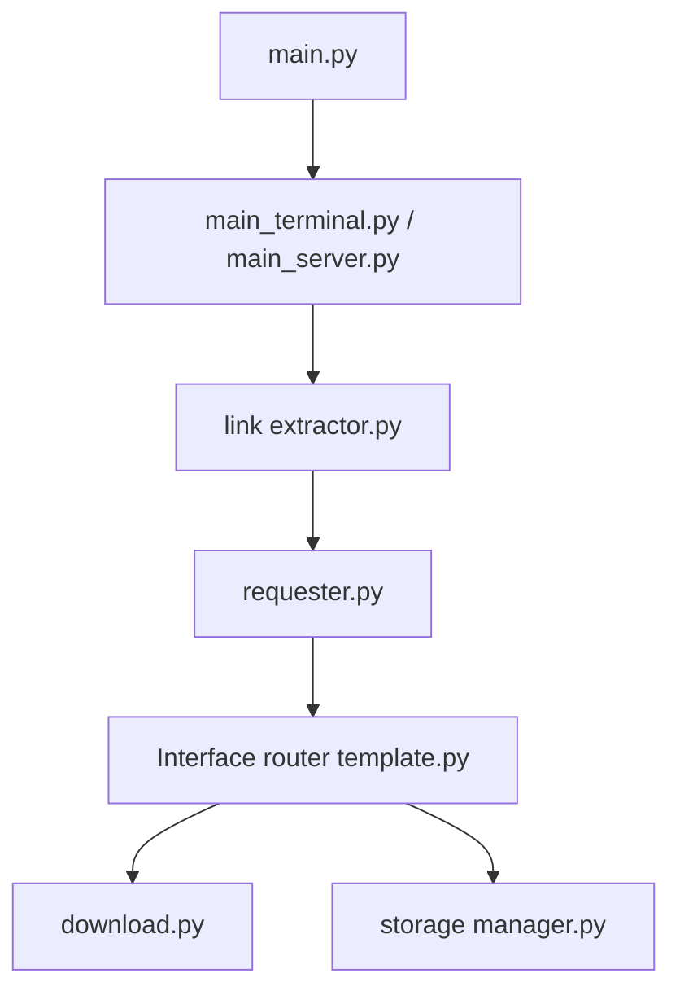

# JoeanAmier/TikTokDownloader

> Collecteur et téléchargeur de vidéos et de métadonnées Douyin et TikTok, en ligne de commande ou via API.

## Le problème
Récupérer en masse les vidéos, commentaires ou statistiques de comptes Douyin et TikTok n'est prévu par aucune API officielle.

## Ce que ça fait vraiment
Il télécharge vidéos, galeries, lives (via ffmpeg), collections et favoris, en incrémental et avec reprise sur coupure.
Il collecte commentaires, recherches, tendances et données de comptes, qu'il exporte en CSV, XLSX ou SQLite.
Il tourne en terminal ou en API Web (`127.0.0.1:5555/docs`). L'interface web est en refonte.
Il génère les jetons anti-bot (xBogus, aBogus, msToken) et lit les cookies.

## Comment c'est branché

## Essayer
Le README décrit en chinois les commandes `uv sync --no-dev`, `uv run main.py`, `pip install -r requirements.txt` et `docker pull joeanamier/tiktok-downloader`, sans bloc de code.

## Coût et pièges
Il faut fournir des cookies de compte. La licence est GPL-3.0. Le respect des CGU des plateformes et du droit d'auteur est à ta charge.

## Ce que ce n'est pas
Ce n'est pas une API officielle : il dépend de la rétro-ingénierie des signatures et peut casser à tout moment. Il ne télécharge pas les contenus payants.

## Alternatives
Le README cite Douyin_TikTok_Download_API (Evil0ctal) et f2 (Johnserf-Seed) comme références.

## Pour toi
À ignorer : c'est du scraping juridiquement fragile. À considérer seulement pour un dataset de recherche, après une vraie revue de conformité.
