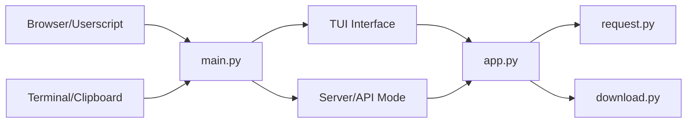

# JoeanAmier/XHS-Downloader

> Téléchargeur de contenus Xiaohongshu (RedNote) en CLI, TUI, API ou MCP, pour archiveurs et scrapers.

## Le problème
Récupérer images, vidéos et métadonnées de posts Xiaohongshu à la main est lent, et la plateforme ne propose pas d'export.

## Ce que ça fait vraiment
Extrait les infos et les URL de téléchargement d'un post à partir de son lien, télécharge fichiers, couvertures et livePhoto, saute les doublons (ExploreID.db).
Trois modes serveur : TUI, API HTTP (`/xhs/detail` sur le port 5556) et serveur MCP pour un assistant IA.
Un script Tampermonkey extrait les liens (profil, favoris, recherche) et pousse les tâches au programme.
Configuration par `settings.json` : cookie, proxy, format d'image, nommage des fichiers, SQLite optionnel.

## Comment c'est branché


## Essayer
```bash
uv sync --no-dev
uv run main.py
docker pull joeanamier/xhs-downloader
```

## Coût et pièges
Gratuit ; cookie Xiaohongshu parfois nécessaire, liens anciens exposés au contrôle anti-robot de la plateforme.
Python ≥ 3.12 ; lecture du cookie navigateur sous Windows exige les droits administrateur.

## Ce que ce n'est pas
Pas un outil généraliste de scraping : une seule plateforme, chinoise.
GPL-3.0 et avertissement juridique très restrictif (usage commercial, droits d'auteur à ta charge).

## Alternatives
- JoeanAmier/TikTokDownloader : même auteur, pour Douyin/TikTok.
- JoeanAmier/KS-Downloader : même auteur, pour Kuaishou.

## Pour toi
À ignorer : utile seulement si tu constitues un corpus Xiaohongshu, et le cadre légal du scraping y reste à ta charge.
