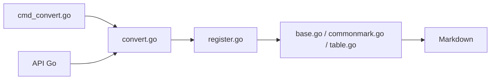

# JohannesKaufmann/html-to-markdown

> Convertisseur HTML vers Markdown en Go, utilisable en bibliothèque ou en ligne de commande.

## Le problème
Extraire du texte propre de pages web pour du RAG ou de l'archivage donne vite un Markdown cassé.

## Ce que ça fait vraiment
Parse le HTML, applique des plugins (base, CommonMark, tableaux, barré), gère l'échappement et l'espace. Options : domaine pour passer les liens en absolu, sélecteurs d'inclusion et d'exclusion. Entrée UTF-8 attendue ; ne sanitise pas le contenu non fiable.

## Comment c'est branché


## Essayer
```bash
go get -u github.com/JohannesKaufmann/html-to-markdown/v2
brew install JohannesKaufmann/tap/html2markdown
echo "<strong>important</strong>" | html2markdown
html2markdown --input file.html --output file.md
```

## Coût et pièges
Gratuit. Le CLI v2 ne couvre pas toutes les options ; plusieurs plugins sont « planned ».

## Ce que ce n'est pas
Pas un extracteur de contenu principal : exclure la navigation se fait par sélecteurs. Pas de détection d'encodage.

## Alternatives
Aucune citée dans le README (la v1 reste sur la branche « v1 »).

## Pour toi
Brique simple pour préparer des corpus web en Markdown, si tu es à l'aise avec Go ou un binaire : adopter.

