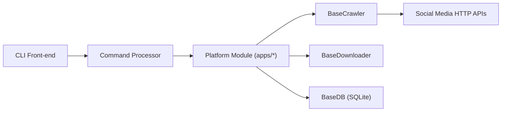

# Johnserf-Seed/f2

> Bibliothèque et CLI Python qui téléchargent des contenus de Douyin, TikTok, Twitter et Weibo.

## Le problème
Récupérer en masse des vidéos, profils, directs et commentaires de réseaux sociaux sans API officielle exploitable.

## Ce que ça fait vraiment
Un sous-paquet par plateforme (`apps/douyin`, `tiktok`, `twitter`, `weibo`, `bark`), chacun avec `api`, `crawler`, `dl`, `db`, `filter`, `handler`, `model`. Des classes de base communes gèrent les requêtes HTTP et WebSocket (httpx), le téléchargement, SQLite (aiosqlite), la config YAML, les logs et l'i18n. Il génère des signatures (`XBogus`, `ABogus`, `msToken`) pour contourner les protections, sait enregistrer des directs et relayer leurs commentaires, et notifie via Bark.

## Comment c'est branché

## Essayer
Le README affiche seulement la table des matières : installation et commandes renvoient à la documentation en ligne. Aucune commande n'est présente dans la matière fournie.

## Coût et pièges
Gratuit. Cookies de compte requis pour le contenu privé. Le projet est en version « preview » et suit les changements d'API des plateformes ; les changements de config cassent les anciennes versions. Sponsor : TikHub, service payant.

## Ce que ce n'est pas
Pas une API officielle : les protections des plateformes peuvent le rendre inopérant. Le README exige le respect des règles de scraping et décline toute responsabilité.

## Alternatives
- TikHub : API commerciale du sponsor (700+ points d'accès), payante.

## Pour toi
À ignorer : le scraping de réseaux sociaux sort du cadre d'un profil data/IA/MLOps et expose à des risques juridiques et de blocage.

