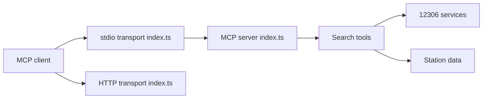

# Joooook/12306-mcp

> Serveur MCP qui laisse un modèle de langage chercher des billets de train sur 12306 (Chine).

## Le problème
Un assistant IA ne peut pas interroger directement le service ferroviaire chinois 12306.

## Ce que ça fait vraiment
Serveur MCP en TypeScript, en stdio ou HTTP, qui expose des outils de recherche de billets, filtrage de trains, consultation des arrêts d'un trajet et recherche de correspondances, avec une ressource de données de gares. Le code se concentre dans `src/index.ts`.

## Comment c'est branché


## Essayer
```bash
npx -y 12306-mcp
npx -y 12306-mcp --port 8080
```

## Coût et pièges
Gratuit. Node 18+ ; dépend du service 12306, hors de ton contrôle. Docker disponible.

## Ce que ce n'est pas
Pas un outil de réservation : seulement de la recherche. L'auteur précise qu'il est « pour l'apprentissage ».

## Alternatives
Un skill équivalent existe (Joooook/12306-skill, cité dans le README).

## Pour toi
À ignorer : utile seulement pour voyager en Chine ; garde-le comme exemple simple de serveur MCP TypeScript.

