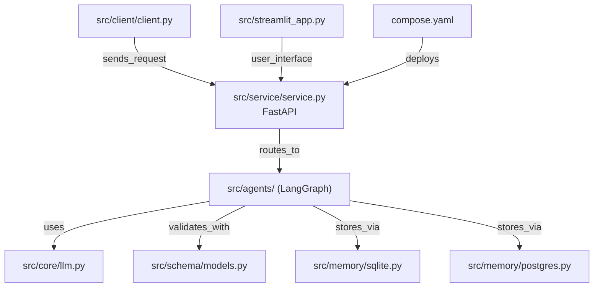

# JoshuaC215/agent-service-toolkit

> Modèle de service complet pour exposer un agent LangGraph en API et en interface de chat.

## Le problème
LangGraph donne le graphe, pas le service : streaming, historique de conversations, modération,
client, interface et déploiement restent à écrire avant la première démo montrable.

## Ce que ça fait vraiment
Assemble un agent LangGraph, un service FastAPI qui le sert en streaming et hors streaming, un
client réutilisable et une appli Streamlit de chat, avec schémas et réglages en Pydantic. Implémente
les fonctions LangGraph v1.0 : `interrupt()` pour l'humain dans la boucle, `Command` pour le
contrôle de flux, `Store` pour la mémoire longue, `langgraph-supervisor`. Plusieurs agents cohabitent
et s'appellent par chemin d'URL, `/info` listant agents et modèles. Les conversations passées se
listent par `/threads`, avec une barre latérale dans Streamlit. Chaque agent est aussi servi via le
protocole AG-UI pour brancher un front compatible comme CopilotKit. Inclut un agent RAG ChromaDB, la
modération par Safeguard, un retour d'appréciation étoilé relié à LangSmith, et des tests unitaires
et d'intégration.

## Comment c'est branché


## Essayer
```bash
git clone https://github.com/JoshuaC215/agent-service-toolkit.git && cd agent-service-toolkit
echo 'OPENAI_API_KEY=your_openai_api_key' >> .env
curl -LsSf https://astral.sh/uv/0.12.5/install.sh | sh
uv sync --frozen && source .venv/bin/activate
python src/run_service.py
streamlit run src/streamlit_app.py
docker compose watch
docker compose up --build
langgraph dev
./scripts/smoke_test.sh
```

## Coût et pièges
Au moins une clé de LLM est obligatoire ; la modération Safeguard exige en plus une clé Groq.
`docker compose watch` demande Docker Compose ≥ v2.23.0. Toucher à `pyproject.toml` ou `uv.lock`
impose un rebuild. Les checkpointers Postgres/MongoDB, l'endpoint AG-UI et le traçage LangFuse ne
sont pas couverts par la CI : `scripts/smoke_test.sh` existe justement pour ça, et vérifie qu'on n'a
pas silencieusement basculé sur SQLite.

## Ce que ce n'est pas
Pas un framework : c'est un gabarit à copier et modifier, et son organisation de fichiers devient la
tienne. Pas un produit multi-locataire : l'authentification n'est mentionnée que comme variable
d'environnement d'en-tête. Les credentials fichiers passent par `privatecredentials/`, ignoré de git.

## Alternatives
- PolyRAG : étend ce toolkit avec du RAG sur Postgres et PDF.
- `alexrisch/agent-web-kit` : un front Next.js à la place de Streamlit.

## Pour toi
Le meilleur point de départ du lot pour livrer un agent LangGraph en service, tests compris.
