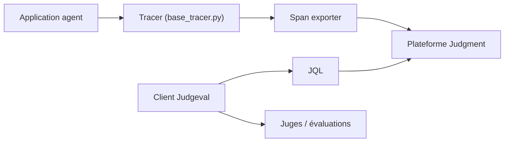

# JudgmentLabs/judgeval

> SDK Python de traçage OpenTelemetry et d'évaluation par juges pour agents LLM, relié à la plateforme Judgment.

## Le problème
Un agent en production échoue de façon diffuse : il faut tracer, classer les échecs et valider les correctifs sur des cas réels.

## Ce que ça fait vraiment
`@Tracer.observe()` capture entrées, sorties et tokens via OpenTelemetry ; des wrappers couvrent OpenAI, Anthropic, Google GenAI, Together, LangGraph, OpenLit et Claude Agent SDK. Juges basés sur prompts, jeux de données, évaluations rejouables, requêtes JQL sur l'historique, monitoring en ligne et alertes Slack côté serveur. CLI et serveur MCP séparés.

## Comment c'est branché


## Essayer
```bash
pip install judgeval
export JUDGMENT_API_KEY=...
export JUDGMENT_ORG_ID=...
```
Le README donne ensuite `Tracer.init(project_name="my-project")` et `wrap(OpenAI())`.

## Coût et pièges
Compte Judgment (clé + org) requis : les traces partent vers leur plateforme ; tarifs non précisés. Le chemin d'implémentation du monitoring en ligne n'est pas visible dans le code échantillonné.

## Ce que ce n'est pas
Pas un outil 100 % local : le SDK est libre, le back-end est un service.

## Alternatives
Le README cite OpenLit comme intégration, pas comme substitut.

## Pour toi
À surveiller : bon si tu veux du traçage d'agents adossé à OpenTelemetry, à condition d'accepter la dépendance à la plateforme.
