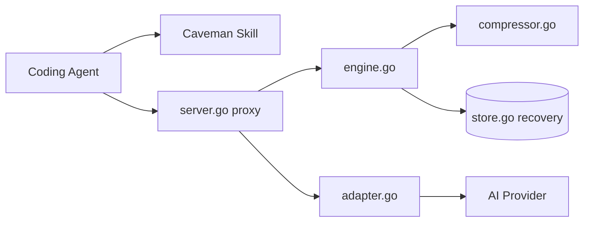

# JuliusBrussee/caveman

> Skill, proxy local et middleware qui réduisent les tokens écrits et lus par un agent de code.

## Le problème
Un agent de code facture chaque token : il écrit des préambules verbeux et lit des logs, sorties de tests et diffs entiers.

## Ce que ça fait vraiment
Trois pièces. La skill : un fichier de règles qui fait répondre l'agent en style télégraphique (niveaux `lite`, `ultra`…), sans toucher code, commandes, chemins ni messages d'erreur. Le proxy : un serveur local (`server.go`) entre l'agent et le fournisseur, qui compresse ce qui est lu (`engine.go`, `compressor.go`) et garde l'original récupérable (`store.go`). Le middleware : un wrapper TypeScript ou Python autour des appels LangChain, Vercel AI SDK, OpenAI ou Anthropic.
Les gains annoncés (1,4 à 2,4× selon un papier d'Adobe Research, test JetBrains) viennent du README : ils ne sont pas vérifiés ici.

## Comment c'est branché


## Essayer
```bash
npx skills add JuliusBrussee/caveman -g
npm install -g @caveman-ai/cli && caveman setup --install
caveman claude
```

## Coût et pièges
La skill est sous MIT ; le runtime du proxy est sous BSL-1.1. Installeur complet : Node.js 22.13+ ; middleware Python : 3.13+, encore en alpha.

## Ce que ce n'est pas
Un proxy qui réécrit ce que lit l'agent, pas un simple style d'écriture : ajouter un intermédiaire sur tes appels n'est pas anodin. Le middleware est en alpha. Le README n'est pas neutre : chiffres et classements y servent d'argument.

## Alternatives
Aucune alternative nommée dans la partie lue du README (la section « How it compares » est tronquée).

## Pour toi
La skill se teste en une commande ; le proxy BSL est à surveiller avant de le placer sur des appels réels.
