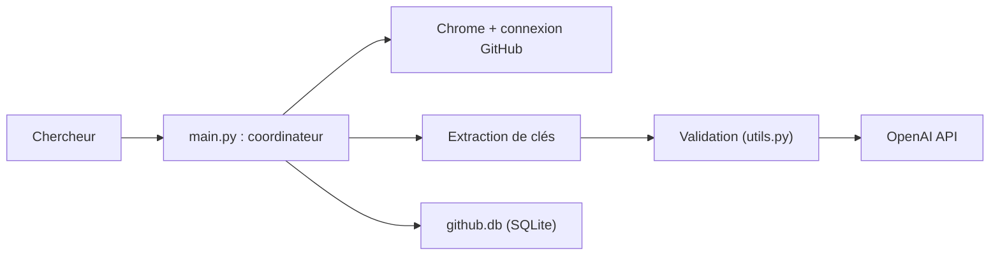

# Junyi-99/ChatGPT-API-Scanner

> Scanne GitHub pour trouver des clés d'API OpenAI valides, présenté comme outil de recherche en sécurité.

## Le problème
Des clés d'API fuitent dans du code public ; l'outil cherche à les repérer.

## Ce que ça fait vraiment
Pilote Chrome via Selenium (recherche web GitHub avec regex, par mots-clés et langages), extrait les clés candidates, les teste auprès d'OpenAI et stocke leur statut dans une base SQLite `github.db`. Reprise de scan, recontrôle des clés déjà trouvées, dédoublonnage. Le README note que la push protection de GitHub (2024) réduit fortement son efficacité.

## Comment c'est branché


## Essayer
```bash
git clone https://github.com/Junyi-99/ChatGPT-API-Scanner
cd ChatGPT-API-Scanner
uv sync
uv run main.py
```

## Coût et pièges
Chrome et compte GitHub requis ; limites de débit GitHub et OpenAI. Tester des clés qui ne sont pas les tiennes peut être illégal : le README avertit contre tout usage illicite.

## Ce que ce n'est pas
Pas un outil de défense : il n'aide pas à protéger tes clés. Les clés des captures d'écran sont expirées.

## Alternatives
Le README ne cite aucune alternative ; il renvoie seulement vers des conseils de bonne gestion des clés.

## Pour toi
À ignorer : outil offensif dont l'usage est juridiquement délicat et sans valeur pour un profil data/MLOps, pour qui l'analyse de secrets se fait avec les outils de sécurité de la plateforme.
