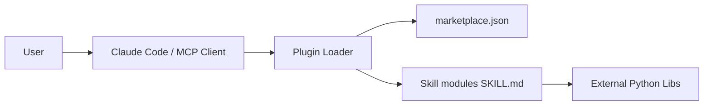

# K-Dense-AI/claude-scientific-skills

> Collection de 166 skills scientifiques pour agents compatibles Agent Skills, pour chercheurs et data scientists.

## Le problème
Un agent connaît mal les API de bases scientifiques et les bibliothèques spécialisées, et on réécrit sans cesse les mêmes consignes.

## Ce que ça fait vraiment
Des dossiers `SKILL.md` avec références et scripts : bases de données (un skill unifié en couvre 78), paquets Python (RDKit, Scanpy, scikit-learn…), intégrations de labo, outils de rédaction. Le dépôt est aussi un plugin (`plugin.json` + `skills/`).

## Comment c'est branché


## Essayer
```bash
gh skill install K-Dense-AI/scientific-agent-skills
gh skill install K-Dense-AI/scientific-agent-skills scanpy
gh skill update --all
```

## Coût et pièges
Le dépôt est gratuit, mais certains skills appellent des API (Benchling, Exa, Modal…) qui demandent une clé. Installer les 166 skills pèse lourd en contexte : le README conseille un sous-ensemble.

## Ce que ce n'est pas
Pas une application. Les skills viennent aussi de contributions communautaires, moins relues. La licence du dépôt (MIT d'après le README) n'est pas déclarée dans le catalogue, et chaque skill a sa licence.

## Alternatives
Le README ne nomme pas d'alternative directe. Il cite anthropics/skills, d'où viennent les skills docx, pdf, pptx et xlsx.

## Pour toi
À surveiller : pioche seulement les skills utiles (scikit-learn, statistiques, visualisation) et lis chaque `SKILL.md` avant d'installer.
