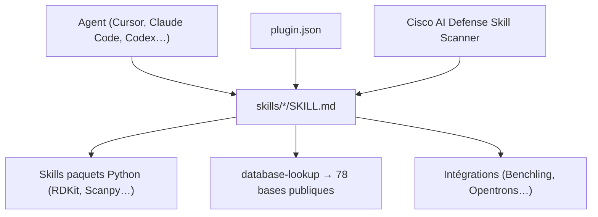

# K-Dense-AI/scientific-agent-skills

> Collection de 166 skills scientifiques pour agents, du génomique au géospatial.

## Le problème
Un agent sait écrire du Python, mais se perd dans les API de ChEMBL, Scanpy ou pydicom :
chaque tâche recommence par une exploration de documentation.

## Ce que ça fait vraiment
Fournit 166 skills au standard Agent Skills, chacun avec son `SKILL.md`, ses exemples de code,
ses cas d'usage et ses références. Le dépôt est aussi un paquet Agent Plugins (`plugin.json` + `skills/`).
Couvre 78 bases publiques via un skill `database-lookup` unique, plus DepMap, PrimeKG, AlphaGenome ;
70+ skills de paquets Python (RDKit, Scanpy, PyTorch Lightning, scikit-learn, GeoPandas, Qiskit) ;
9 skills d'intégration (Benchling, DNAnexus, Opentrons) et 30+ outils d'analyse et de rédaction.
Tout skill livrant des `scripts/` doit avoir une suite de tests, la CI bloque sinon.

## Comment c'est branché


## Essayer
```bash
gh skill install K-Dense-AI/scientific-agent-skills
gh skill install K-Dense-AI/scientific-agent-skills scanpy --agent claude-code
gh skill install K-Dense-AI/scientific-agent-skills --pin v2.66.0
npx skills add K-Dense-AI/scientific-agent-skills
uv pip install cisco-ai-skill-scanner && skill-scanner scan /path/to/skill --use-behavioral
```

## Coût et pièges
Les skills sont gratuits, les services qu'ils appellent non : Exa, Parallel, Benchling, NCBI
demandent des clés. Python 3.13+ pour l'outillage du dépôt, `uv` requis. Le README avertit lui-même :
un skill exécute du code arbitraire, et l'équipe ne peut pas avoir tout relu.

## Ce que ce n'est pas
Ce n'est pas un agent ni un modèle : ce sont des consignes. Ce n'est pas une garantie de sûreté —
les contributions communautaires sont revues « au mieux ». Ce n'est pas à installer en bloc :
166 skills pèsent lourd dans le contexte, le README recommande un sous-ensemble.

## Alternatives
- **anthropics/skills** : source amont des skills docx, pdf, pptx, xlsx repris ici.

## Pour toi
À piller par sous-ensembles si tu touches à la bio-info ; à ignorer sinon, le contexte coûte cher.
