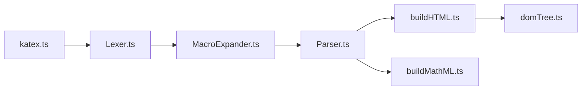

# KaTeX/KaTeX

> Rendu de formules TeX en JavaScript, synchrone, pour le web ou côté serveur.

## Le problème
Afficher des maths proprement sur une page web sans reflow ni dépendance lourde.

## Ce que ça fait vraiment
`katex.render` écrit une formule dans un élément DOM ; `katex.renderToString` renvoie du HTML (rendu côté serveur possible). En interne : lexer, expansion de macros, analyseur, puis constructeurs HTML et MathML. Extensions : auto-render, copy-tex, mhchem. Couvre une grande partie de LaTeX, pas tout.

## Comment c'est branché


## Essayer
```js
katex.render("c = \\pm\\sqrt{a^2 + b^2}", element, {
    throwOnError: false
});
var html = katex.renderToString("c = \\pm\\sqrt{a^2 + b^2}", {
    throwOnError: false
});
```

## Coût et pièges
Gratuit. Il faut inclure la feuille CSS et les polices, même en rendu serveur. 397 issues ouvertes.

## Ce que ce n'est pas
Pas un compilateur LaTeX : seulement les formules, et seulement un sous-ensemble des fonctions.

## Alternatives
Aucune alternative nommée dans le README (il mentionne un concurrent via un test de vitesse sans le nommer).

## Pour toi
Pratique pour afficher des formules dans des rapports, notebooks exportés ou dashboards web ; rendu rapide et sans dépendance, à adopter.

