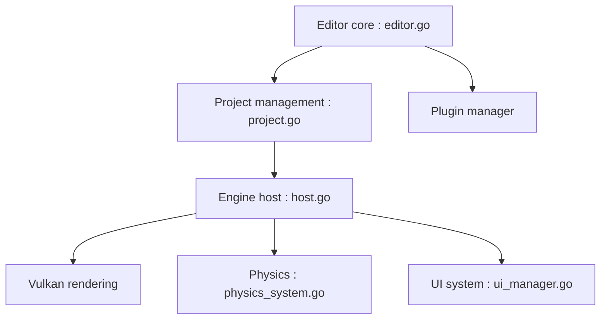

# KaijuEngine/kaiju

> Moteur de jeu 2D/3D écrit en Go sur Vulkan, avec un éditeur intégré.

## Le problème
Créer des jeux avec un moteur en langage système simple plutôt que C++ ou C#.

## Ce que ça fait vraiment
Moteur Go avec rendu Vulkan, physique, audio (Soloud), animation, UI maison avec option HTML/CSS, terrain, scripts Lua et plugins d'éditeur en Go. L'éditeur est lui-même un jeu tournant dans le moteur. Cibles : Windows, Linux, Mac, Android. L'auteur annonce lui-même que l'éditeur n'est pas prêt.

## Comment c'est branché


## Essayer
```bash
git clone --recurse-submodules https://github.com/KaijuEngine/kaiju.git
mkdir bin/
cd src
go build -tags="debug,editor,filedrop" -o ../bin/ ./
```

## Coût et pièges
Gratuit. Il faut Go, outils C, bibliothèques de plateforme et Vulkan. Sous Windows, des DLL MinGW peuvent manquer. Les chiffres de FPS du README sont des mesures de l'auteur.

## Ce que ce n'est pas
Pas un moteur éprouvé : « work in progress », éditeur non prêt. Licence non identifiée.

## Alternatives
Le README compare à Unity, Unreal et Godot sans les proposer comme alternatives détaillées.

## Pour toi
À ignorer : aucun lien avec data/IA/MLOps, et projet jeune porté par une personne.

