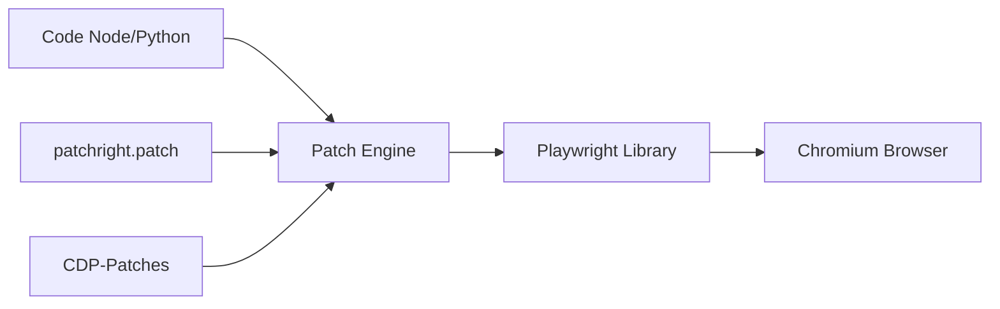

# Kaliiiiiiiiii-Vinyzu/patchright

> Version modifiée de Playwright pour Chromium, conçue pour réduire les signaux d'automatisation détectables par les sites.

## Le problème
Un navigateur piloté par Playwright expose des indices d'automatisation, ce qui fausse tests et collectes sur des sites qui les repèrent.

## Ce que ça fait vraiment
Ce dépôt contient le pilote patché ; il s'utilise en remplacement direct de Playwright via les paquets Python ou Node. Le README décrit des correctifs sur des signaux du protocole de débogage, sur des arguments de lancement par défaut et sur l'accès aux shadow roots fermés. Seul Chromium est concerné. La console du navigateur est désactivée. Les listes de « tests réussis » viennent de l'auteur.

## Comment c'est branché


## Essayer
```bash
# Aucune commande dans ce README (dépôt du pilote) :
# il renvoie aux paquets Python, NodeJS et .NET.
```

## Coût et pièges
Gratuit. Le README affiche des sponsors de proxys avec codes promo. Des bugs restent possibles : la suite de tests Playwright n'est pas entièrement réussie, et les corrections suivent les mises à jour de Playwright avec quelques jours de retard.

## Ce que ce n'est pas
Ce n'est pas un outil de test classique : son but est de rendre l'automatisation moins repérable. Son usage doit respecter le droit et les conditions des sites visés ; le README le présente comme éducatif, sans garantie ni responsabilité.

## Alternatives
- Playwright : l'original, pour des tests sans besoin de discrétion.
- CDP-Patches : projet complémentaire cité dans le README.

## Pour toi
À surveiller : pertinent pour des tests ou collectes légitimes sur des sites qui bloquent l'automatisation ; vérifie d'abord ton droit d'accès.
