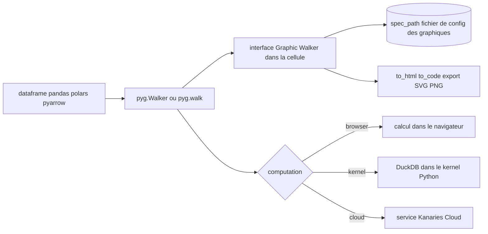

# Kanaries/pygwalker

> **Turns a dataframe into a drag-and-drop visual exploration UI, inside a notebook or Streamlit.**

## The problem

Exploring a dataframe in a notebook means writing one plotting cell per question: a groupby, a
`plot`, read it, start over with another variable. Every cross-tab costs throwaway code, and the
state of the exploration is kept nowhere. Moving to an external BI tool means taking the data
out of the kernel.

## What it actually does

PyGWalker ("**Py**thon binding of **G**raphic **Walker**") connects the dataframe to
[Graphic Walker](https://github.com/Kanaries/graphic-walker), a web UI the README presents as an
open-source alternative to Tableau, and renders it in the notebook cell.

- Takes pandas, polars and pyarrow tables, plus a database connector, a SQL/data-source string
  or a reusable `Walker` object.
- Builds charts by dragging fields onto rows and columns: changing the mark type, concat views
  with several measures, facet views.
- Ships a data table with preview, distribution profiling, filters and type changes.
- Saves and reloads chart state in a local config file (`spec_path`), and can turn that state
  back into Python via `walker.to_code()`.
- Exports a saved chart to SVG or PNG from Python.
- Renders outside notebooks too: `walker.to_html()`, and `StreamlitRenderer` for a Streamlit app.

## How it is wired



The `Walker` object is the hub: it receives the data, feeds the Graphic Walker UI and decides
where queries run. The `computation` parameter arbitrates between three engines — `browser`
(everything frontend-side), `kernel` (DuckDB in the Python kernel, which the README recommends
for bigger datasets) and `cloud` (computation at Kanaries). Exploration state leaves through
`spec_path`; rendering leaves through `show()`, `to_html()` or `StreamlitRenderer`. The README
points to `docs/ARCHITECTURE.md` for the Python/frontend link, not read here.

## Trying it

```bash
pip install pygwalker
```

```bash
conda install -c conda-forge pygwalker
```

```python
import pandas as pd
import pygwalker as pyg

df = pd.read_csv('./bike_sharing_dc.csv')
walker = pyg.walk(df)
```

```python
walker = pyg.Walker(df, spec_path="./chart_meta_0.json", computation="browser")
walker.show()       # auto-detects notebook or script mode
html = walker.to_html()
```

```bash
pygwalker config --list
```

## Cost and traps

Install with pip or conda, nothing else to provision: `browser` and `kernel` (DuckDB) modes run
locally. Four things to know:

- **Telemetry on by default.** The `privacy` setting defaults to `update-only` — a new-version
  check. `offline` stops every outbound call; `events` sends which features are used, bound to a
  unique id generated at install time. Set it with `pygwalker config --set privacy=offline`.
- **The cloud half is a separate paid third-party service.** `computation="cloud"`,
  `kanaries_api_key`, chart sharing and the "GPT-powered" features go through a Kanaries account
  and token from kanaries.net. The README does not document pricing.
- **API churn in flight.** `use_kernel_calc`, `kernel_computation`, `cloud_computation` and the
  `env` values `Jupyter`/`JupyterWidget` are scheduled for removal in 0.7.0. Older code must move
  to `computation=`; old specs migrate with `pyg.spec.migrate`.
- In Streamlit the README insists the renderer be cached (`@st.cache_resource`), otherwise memory
  blows up.

The README is written in promotional register ("powerful tool", "seamless integration", "Cool
things you can do"): the Features list reads as intent, not as a contract.

## What it is not

Not an enterprise BI tool: no multi-user server, no permissions, no scheduled refresh — the unit
of work stays a notebook cell or a Streamlit page. Not a compute engine either: PyGWalker is a
UI, the work is done by the browser, by DuckDB in the kernel, or by Kanaries cloud depending on
`computation`. Not a reproducible reporting system: `to_code()` replays one chart's state, not a
pipeline. And it is not Graphic Walker itself, which lives in a separate repo — PyGWalker is the
Python binding to it.

## Alternatives

- **[Sinaptik-AI/pandas-ai](https://github.com/Sinaptik-AI/pandas-ai)** — same ground (exploring a
  dataframe without writing the code) but through natural-language queries backed by an LLM
  instead of drag-and-drop; pick it to ask questions rather than manipulate axes, if an API key
  is acceptable.
- **[pandas-dev/pandas](https://github.com/pandas-dev/pandas)** — the layer underneath: the
  dataframe PyGWalker displays. Pick plain pandas when exploration fits in a few `groupby` calls
  and no frontend dependency is wanted.
- **[Kanaries/GWalkR](https://github.com/Kanaries/GWalkR)** — named in the README: the same
  Graphic Walker UI, for R. Pick it when the work happens in R rather than Python.

The README also cites `panel-graphic-walker` and PyGWalker Desktop, which are ports of the same
UI rather than competitors.

## For you

Immediate payoff on the exploration phase: one `pyg.walk(df)` replaces half an hour of throwaway
plotting cells, and `spec_path` keeps the exploration between sessions. The
`computation="kernel"` (DuckDB) mode makes it usable past the size that bogs a notebook down.
Install it with `privacy=offline` if the data is sensitive, and stay clear of the flags marked
for removal in 0.7.0.
