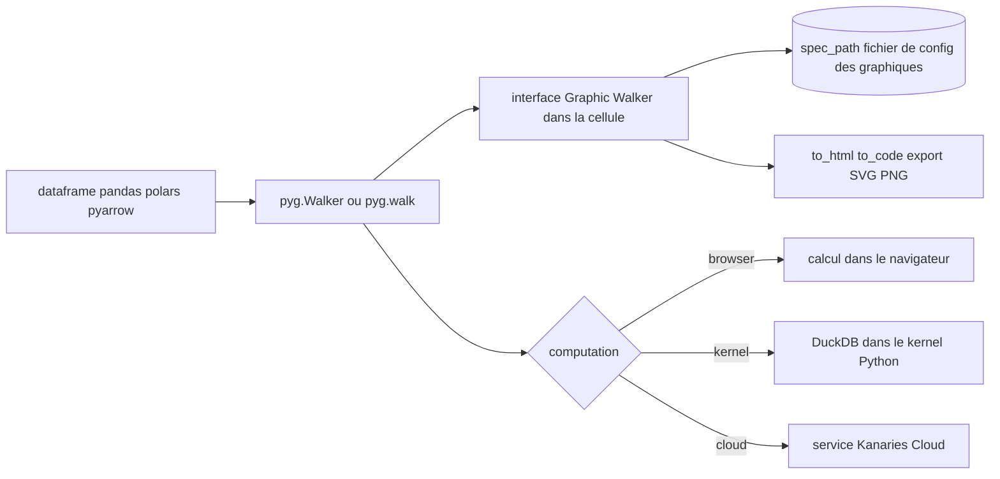

# Kanaries/pygwalker

> **Transforme un dataframe en interface glisser-déposer d'exploration visuelle, dans un notebook ou Streamlit.**

## Le problème

Explorer un dataframe dans un notebook, c'est écrire une cellule de tracé par question posée :
un groupby, un `plot`, on relit, on recommence avec une autre variable. Chaque croisement coûte
du code jetable, et l'état de l'exploration ne se conserve nulle part. Passer à un outil de BI
externe suppose de sortir la donnée du kernel.

## Ce que ça fait vraiment

PyGWalker (« **Py**thon binding of **G**raphic **Walker** ») branche le dataframe sur
[Graphic Walker](https://github.com/Kanaries/graphic-walker), une interface web que le README
présente comme une alternative open source à Tableau, et l'affiche dans la cellule du notebook.

- Accepte pandas, polars et les tables pyarrow, ainsi qu'un connecteur de base, une chaîne
  SQL/source de données ou un objet `Walker` réutilisable.
- Construit les graphiques par glisser-déposer de champs vers lignes et colonnes : changement
  de type de marque, vues concaténées à plusieurs mesures, vues en facettes.
- Fournit une table de données avec aperçu, profilage de la distribution, filtres et changement
  de type.
- Sauvegarde et recharge l'état des graphiques dans un fichier de configuration local
  (`spec_path`), et sait réexporter cet état en code Python via `walker.to_code()`.
- Exporte un graphique sauvegardé en fichier SVG ou PNG depuis Python.
- Se rend aussi hors notebook : `walker.to_html()`, et `StreamlitRenderer` pour une application
  Streamlit.

## Comment c'est branché



Le point central est l'objet `Walker` : il reçoit la donnée, alimente l'interface Graphic Walker
et décide où les requêtes tournent. Le paramètre `computation` arbitre entre trois moteurs —
`browser` (tout côté frontend), `kernel` (DuckDB dans le kernel Python, ce que le README
recommande pour les jeux plus gros) et `cloud` (calcul chez Kanaries). L'état de l'exploration
sort par `spec_path` ; le rendu sort par `show()`, `to_html()` ou `StreamlitRenderer`. Le README
renvoie à `docs/ARCHITECTURE.md` pour le détail de la liaison Python/frontend, non lu ici.

## Essayer

```bash
pip install pygwalker
```

```bash
conda install -c conda-forge pygwalker
```

```python
import pandas as pd
import pygwalker as pyg

df = pd.read_csv('./bike_sharing_dc.csv')
walker = pyg.walk(df)
```

```python
walker = pyg.Walker(df, spec_path="./chart_meta_0.json", computation="browser")
walker.show()       # auto-detects notebook or script mode
html = walker.to_html()
```

```bash
pygwalker config --list
```

## Coût et pièges

Installation par pip ou conda, rien d'autre à provisionner : le mode `browser` et le mode
`kernel` (DuckDB) tournent en local. Trois points à connaître :

- **Télémétrie par défaut.** Le réglage `privacy` vaut `update-only` par défaut — vérification
  de nouvelle version. `offline` coupe tout envoi ; `events` transmet les fonctionnalités
  utilisées, liées à un identifiant unique généré à l'installation. Réglage via
  `pygwalker config --set privacy=offline`.
- **La partie cloud est un service tiers payant à part.** `computation="cloud"`,
  `kanaries_api_key`, le partage de graphiques et les fonctions « GPT » passent par un compte
  et un jeton Kanaries à récupérer sur kanaries.net. Le README n'en documente pas le tarif.
- **Churn d'API en cours.** `use_kernel_calc`, `kernel_computation`, `cloud_computation` et les
  valeurs d'`env` `Jupyter`/`JupyterWidget` sont annoncés pour suppression en 0.7.0. Du code
  écrit sur les versions antérieures devra migrer vers `computation=` ; les anciennes specs
  se migrent avec `pyg.spec.migrate`.
- En Streamlit, le README insiste pour mettre le renderer en cache (`@st.cache_resource`)
  sous peine de faire exploser la mémoire.

Le README est écrit en registre promotionnel (« powerful tool », « seamless integration »,
« Cool things you can do ») : les capacités listées dans la section Features sont à lire comme
des intentions, pas comme un contrat.

## Ce que ce n'est pas

Ce n'est pas un outil de BI d'entreprise : pas de serveur multi-utilisateurs, pas de gestion de
droits, pas de rafraîchissement planifié — l'unité de travail reste la cellule d'un notebook ou
une page Streamlit. Ce n'est pas non plus un moteur de calcul : PyGWalker est une interface, le
travail est fait par le navigateur, par DuckDB dans le kernel ou par le cloud Kanaries selon
`computation`. Ce n'est pas un générateur de rapports reproductibles : `to_code()` rejoue l'état
d'un graphique, pas un pipeline. Et ce n'est pas Graphic Walker lui-même, qui vit dans un dépôt
séparé — PyGWalker en est la liaison Python.

## Alternatives

- **[Sinaptik-AI/pandas-ai](https://github.com/Sinaptik-AI/pandas-ai)** — même terrain (explorer
  un dataframe sans écrire le code), mais par requêtes en langage naturel adossées à un LLM
  plutôt que par glisser-déposer ; à préférer si l'on veut poser des questions, pas manipuler
  des axes, et si l'on accepte une clé d'API.
- **[pandas-dev/pandas](https://github.com/pandas-dev/pandas)** — la couche en dessous : c'est
  le dataframe que PyGWalker affiche. Choisir pandas seul quand l'exploration tient en quelques
  `groupby` et qu'on ne veut aucune dépendance frontend.
- **[Kanaries/GWalkR](https://github.com/Kanaries/GWalkR)** — nommé dans le README : la même
  interface Graphic Walker, mais pour R. À prendre si le travail se fait côté R plutôt que Python.

Le README cite aussi `panel-graphic-walker` et PyGWalker Desktop, qui sont des portages de la
même interface plutôt que des concurrents.

## Pour toi

Gain immédiat sur la phase d'exploration : un `pyg.walk(df)` remplace une demi-heure de cellules
de tracé jetables, et `spec_path` conserve l'exploration entre deux sessions. Le mode
`computation="kernel"` (DuckDB) le rend utilisable au-delà de la taille qui fait ramer un
notebook. À installer avec `privacy=offline` si la donnée est sensible, et en restant à l'écart
des drapeaux marqués pour suppression en 0.7.0.
