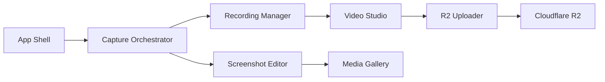

# KartikLabhshetwar/better-shot

> Application macOS open source de capture d'écran, d'enregistrement vidéo et d'édition, pour qui documente ou démontre.

## Le problème
Capturer, annoter, enregistrer puis monter une démo demande d'ordinaire plusieurs outils, souvent payants ou avec compte.

## Ce que ça fait vraiment
- Captures de région, fenêtre ou plein écran, OCR, pipette de couleur, annotations (flèches, flou, texte).
- Enregistrement écran avec audio, micro, caméra, téléprompteur ; montage (coupes, vitesse 0,25× à 8×, zooms, sous-titres, plans 3D).
- Export MP4/MOV ; partage optionnel vers ton propre bucket Cloudflare R2, identifiants stockés dans le Trousseau.
- Actions pilotables par le schéma d'URL `bettershot://`.

## Comment c'est branché


## Essayer
```bash
brew install --cask bettershot
open 'bettershot://capture/region'
```

## Coût et pièges
Gratuit, sans compte BetterShot. Exige macOS 26 ou plus, et plusieurs permissions système (enregistrement d'écran, accessibilité, micro, caméra). Le partage exige ton compte Cloudflare ; les liens sont publics pour quiconque les détient, et l'app contacte GitHub pour les mises à jour.

## Ce que ce n'est pas
Pas un outil de sécurité malgré sa présence dans ce bloc : rien dans le README ne le rend offensif. Pas de version Windows/Linux. Le diagramme précise que certains liens du schéma sont déduits du README, pas du code.

## Alternatives
Aucune alternative nommée dans le README.

## Pour toi
Ignorer : utilitaire de bureau macOS sans lien avec la donnée ou le MLOps, sauf pour enregistrer des démos ; à retenir seulement si tu es sur un Mac récent.

