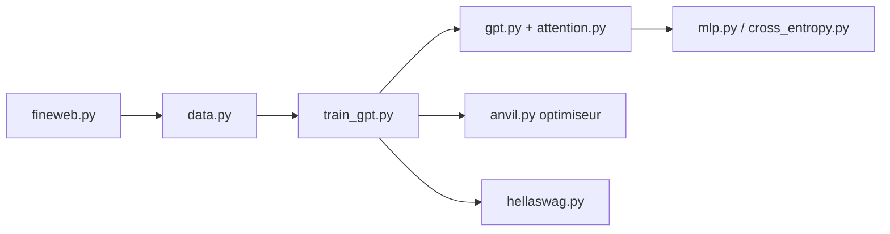

# KellerJordan/modded-nanogpt

> Course de vitesse collaborative pour entraîner un GPT-2 small sur FineWeb en un minimum de temps sur 8 H100.

## Le problème
Les articles sur l'entraînement de LLM utilisent chacun leur banc d'essai, ce qui empêche de savoir quelles techniques marchent vraiment.

## Ce que ça fait vraiment
Un script d'entraînement PyTorch qui atteint 3,28 de perte de validation sur FineWeb en un peu plus d'une minute sur 8 H100 (record 91 à 1,126 minute), contre 45 minutes pour llm.c. Il empile l'optimiseur Muon, FP8, attention FlashAttention 3 avec fenêtres glissantes, embeddings de valeurs, noyaux Triton. Un second palier vise GPT-2 Medium (2,92). Des règles strictes encadrent les nouveaux records.

## Comment c'est branché


## Essayer
```bash
git clone https://github.com/KellerJordan/modded-nanogpt.git && cd modded-nanogpt
pip install -r requirements.txt
python data/cached_fineweb10B.py 9
./run.sh
```

## Coût et pièges
Les records sont chronométrés sur 8 H100 (location chez PrimeIntellect citée). `torch.compile` ajoute environ 7 minutes au premier lancement. Docker conseillé pour un chronométrage précis.

## Ce que ce n'est pas
Pas un cadre d'entraînement réutilisable ni un modèle à déployer. Le README reconnaît que certaines astuces ne passeront pas à l'échelle.

## Alternatives
llm.c (base de référence, 45 minutes) ; forks modded-nanogpt-rwkv et modded-nanogpt-SOAP pour d'autres architectures et optimiseurs.

## Pour toi
Adopter comme source d'idées : le meilleur catalogue daté de techniques d'entraînement efficaces, à lire plus qu'à exécuter faute de 8 H100.

