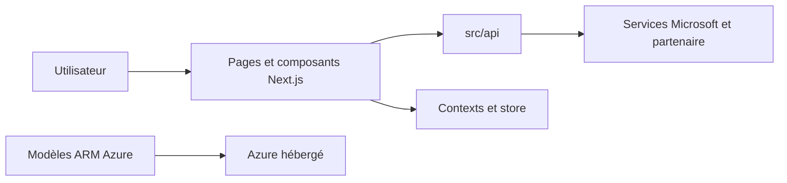

# KelvinTegelaar/CIPP

> Portail d'administration multi-tenant pour partenaires Microsoft qui gèrent plusieurs clients.

## Le problème
Le modèle partenaire de Microsoft rend la gestion de nombreux tenants manuelle et longue.

## Ce que ça fait vraiment
Le README dit seulement que l'outil aide à l'administration, à la gestion des utilisateurs et au déploiement de standards. D'après le code : application Next.js/React (pages identité, messagerie, endpoints, tenants), contextes et store d'état, modèles ARM Azure et workflows GitHub Actions ; les appels partent vers les services Microsoft.

## Comment c'est branché

## Essayer
Aucune commande documentée dans le README ; renvoi au site et à la documentation.

## Coût et pièges
Il faut un compte partenaire Microsoft et un déploiement Azure : le coût d'hébergement n'est pas indiqué. AGPL-3.0 : les modifications servies en réseau doivent être publiées.

## Ce que ce n'est pas
Le README précise que ce n'est pas un outil de sécurité ni un moyen de réduire le coût des abonnements.

## Alternatives
Le README cite Microsoft Lighthouse comme solution possible mais en retard, sans lien de dépôt.

## Pour toi
Ignorer : outil de fournisseur de services gérés Microsoft, sans lien avec un travail data ou MLOps, et sous AGPL.

