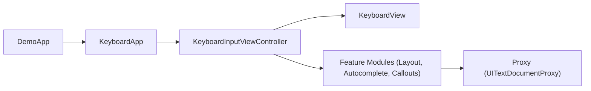

# KeyboardKit/KeyboardKit

> Framework Swift/SwiftUI pour créer des extensions de clavier iOS, avec une version Pro payante.

## Le problème
L'API clavier d'Apple est limitée : disposition, autocomplétion, callouts et retour haptique sont à refaire à la main.

## Ce que ça fait vraiment
Fournit une base ouverte (actions, dispositions, callouts, retours audio/haptiques, statut, thèmes, proxy de texte) et une version Pro sous clé de licence (localisation de 75 langues, autocomplétion, emojis, IA, thèmes). Le README précise que c'est un framework binaire, lié à la seule cible principale. Un exemple d'autocomplétion via Claude figure dans la configuration.

## Comment c'est branché


## Essayer
```swift
// Package Swift Package Manager : https://github.com/KeyboardKit/KeyboardKit.git
class KeyboardController: KeyboardInputViewController {}
```
```bash
git clone https://github.com/KeyboardKit/KeyboardKit.git
```

## Coût et pièges
Le cœur est gratuit ; les fonctions Pro demandent une licence payante. Un fichier de licence est présent mais non reconnu par GitHub : à lire avant usage commercial.

## Ce que ce n'est pas
Pas multiplateforme : iOS uniquement. Le « open source » couvre le moteur, pas les fonctions Pro.

## Alternatives
Aucune alternative nommée dans le README.

## Pour toi
À ignorer : développement d'apps iOS, sans lien avec la donnée ou l'IA, et licence non identifiée.

