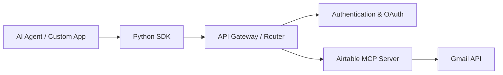

# Klavis-AI/klavis

> Catalogue de serveurs MCP prêts à l'emploi et routeur Strata, hébergés ou auto-hébergés.

## Le problème
Brancher un agent sur Gmail, Slack, GitHub… impose un serveur MCP et un flux OAuth par service.

## Ce que ça fait vraiment
Serveurs MCP par intégration, chacun en image Docker (`ghcr.io/klavis-ai/...`).
Strata : un serveur MCP qui agrège plusieurs intégrations pour un utilisateur.
SDK Python et TypeScript et API REST pour créer des instances par `user_id`.
Le README est très succinct ; le détail est dans la doc externe.

## Comment c'est branché


## Essayer
```bash
docker pull ghcr.io/klavis-ai/github-mcp-server:latest
docker run -p 5000:5000 ghcr.io/klavis-ai/github-mcp-server:latest
pipx install strata-mcp
strata add --type stdio playwright npx @playwright/mcp@latest
```

## Coût et pièges
L'offre hébergée exige une clé klavis.ai ; l'auto-hébergement passe par Docker. Tarifs non documentés.

## Ce que ce n'est pas
Pas un framework d'agents. Le README ne décrit ni la sécurité des jetons OAuth ni les limites de l'offre gratuite.

## Alternatives
Aucune alternative nommée dans le README.

## Pour toi
À surveiller : raccourci pratique pour doter un agent d'outils SaaS, mais README trop maigre pour juger la confiance à accorder à qui détient tes jetons.
