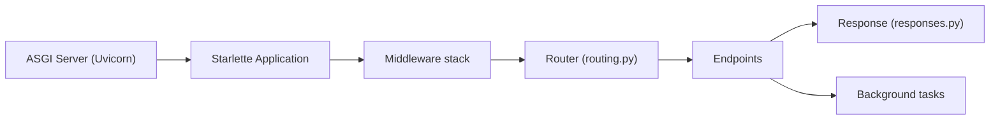

# Kludex/starlette

> Boîte à outils ASGI légère pour écrire des services web asynchrones en Python.

## Le problème
Écrire un service web async en Python sans framework lourd oblige à réimplémenter routage, middlewares, WebSocket et fichiers statiques au-dessus d'ASGI.

## Ce que ça fait vraiment
Une application ASGI appelée par un serveur externe (Uvicorn) : elle fait passer la requête dans une pile de middlewares (CORS, GZip, sessions, hôtes de confiance…), puis un routeur la dirige vers un endpoint HTTP ou WebSocket. Chaque brique (réponses, fichiers statiques, tâches de fond, client de test) s'utilise seule. Les dépendances externes sont optionnelles (jinja2, httpx2, python-multipart, itsdangerous, pyyaml).

## Comment c'est branché


## Essayer
```bash
pip install starlette
pip install uvicorn
uvicorn main:app
```

## Coût et pièges
Gratuit. Un serveur ASGI est à installer à part ; `pip install starlette[full]` tire les dépendances optionnelles.

## Ce que ce n'est pas
Pas un framework « tout compris » : ni ORM, ni validation de données, ni documentation d'API générée. Le README ne mentionne aucune de ces couches.

## Alternatives
Aucune alternative nommée dans le README.

## Pour toi
Adopter : c'est la base propre pour exposer un modèle ou une API de données en async, sous licence BSD-3-Clause, avec peu de dépendances.

