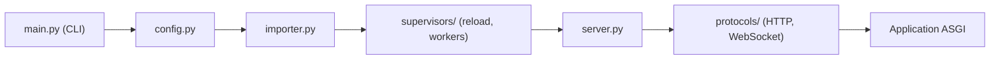

# Kludex/uvicorn

> Serveur web ASGI pour Python, pour faire tourner des applications asynchrones comme FastAPI ou Starlette.

## Le problème
Les serveurs WSGI gèrent mal les connexions longues (WebSocket, long-poll) et les applications asynchrones.

## Ce que ça fait vraiment
Il charge une application ASGI (`module:app`), ouvre les sockets, analyse HTTP/1.1 et WebSocket (le README cite aussi HTTP/2), envoie les messages ASGI à l'application et renvoie la réponse. Il gère le cycle de vie (démarrage/arrêt), le rechargement à chaud et plusieurs processus. Les extras `standard` ajoutent `uvloop`, `httptools`, `websockets` et `watchfiles`.

## Comment c'est branché


## Essayer
```bash
pip install uvicorn
pip install 'uvicorn[standard]'
uvicorn example:app
```

## Coût et pièges
Gratuit. Le README ne mentionne pas de piège ; l'installation `standard` demande des paquets compilés.

## Ce que ce n'est pas
Pas un framework web : il exécute une application que tu écris. Pas un serveur pour du code WSGI classique, sauf via l'adaptateur `wsgi.py`.

## Alternatives
Daphne (premier serveur ASGI, pour Django Channels), Hypercorn (prend en charge trio), Granian (serveur HTTP en Rust), Mangum (adaptateur AWS Lambda).

## Pour toi
À adopter : c'est le serveur par défaut pour exposer un modèle derrière une API FastAPI, mature et sans dépendance imposée.

