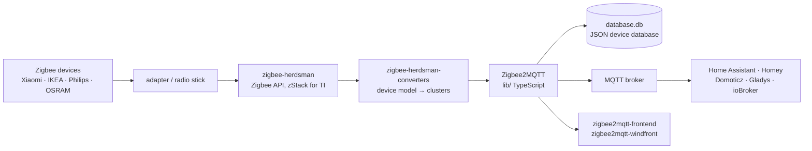

# Koenkk/zigbee2mqtt

> **A software bridge exposing Zigbee devices over MQTT, with no vendor gateway involved.**

## The problem

Every Zigbee vendor — Xiaomi, IKEA, Philips, OSRAM — ships its own bridge, its own cloud and
its own protocol, so sensors and lamps end up in islands that cannot talk to each other and
stop working the day the remote service is retired.

## What it actually does

Zigbee2MQTT talks straight to a Zigbee radio adapter plugged into the machine and republishes
every device event onto an MQTT broker, in both directions: you read state and you send
commands.

The README describes three modules, each developed in its own repository: `zigbee-herdsman`
drives the adapter and exposes a Zigbee API (for Texas Instruments hardware, through the
zStack monitoring and test API); `zigbee-herdsman-converters` maps individual device models to
the Zigbee clusters they support; the Zigbee2MQTT module itself drives herdsman and translates
Zigbee messages into MQTT messages.

It keeps system state in a `database.db` file — a text file holding a JSON database of
connected devices and their capabilities. Two web interfaces are provided for monitoring and
configuration: `zigbee2mqtt-frontend` and `zigbee2mqtt-windfront`.

Supported devices are tracked on the project site; the README states that adding a missing
model is "(fairly) easily" done by following the documented procedure.

## How it is wired

No code-derived diagram exists for this repository: the graph below is reconstructed from the
README alone (the "Internal Architecture" section).



## Trying it

The README documents **no installation command**: getting started is delegated to the
`zigbee2mqtt.io` site and, on Home Assistant OS, to the official `hassio-zigbee2mqtt` addon.
The only commands present are the development ones:

```bash
pnpm install --include=dev
pnpm run build
pnpm run build:watch
pnpm run check:w
pnpm run test:coverage
```

## Cost and gotchas

- **The cost is hardware, not software**: a compatible Zigbee radio adapter is required. The
  README explicitly covers only the Texas Instruments / zStack case; the supported-hardware
  list lives elsewhere.
- **An MQTT broker is an unbundled prerequisite**: Zigbee2MQTT publishes to a broker you must
  install and operate yourself.
- **Local state to back up**: the whole paired network lives in `database.db`. Lose that file
  and you re-pair every device by hand.
- **Recompilation is mandatory** after changing anything under `lib/` (TypeScript), via
  `pnpm run build`.
- An unlisted device means writing the converter yourself, documented procedure or not.
- No API key, no GPU, no quota, no account to create: nothing paid is mentioned in the README
  beyond a PayPal donation link.

## What it is not

- **Not a home automation system.** It decides nothing, has no rule engine and no automations:
  it translates Zigbee into MQTT, and the logic stays in Home Assistant, Domoticz, ioBroker or
  similar.
- **Not a cloud service**: everything runs at home, on the machine holding the radio stick —
  the point of the project, but also your job to keep available, backed up and updated.
- **Not hardware-independent**: without a compatible Zigbee adapter it does nothing, and
  coverage of a given device depends on a converter written for that exact model.

## Alternatives

No comparable alternative in the catalogue: the supplied neighbours (`avelino/awesome-go`,
`parallax/jsPDF`, `AtsushiSakai/PythonRobotics`, `JanDeDobbeleer/oh-my-posh`) have nothing to
do with home automation or Zigbee. The other repositories named in the README are not rivals
but parts of the same stack: `koenkk/zigbee-herdsman` (the raw Zigbee layer, preferable if you
are writing your own bridge without MQTT), `koenkk/zigbee-herdsman-converters` (device
definitions, preferable if you only want to contribute a model) and
`zigbee2mqtt/hassio-zigbee2mqtt` (the same project packaged as an addon, preferable on
Home Assistant OS).

## For you

Off-topic for a data/AI workstation, yet it is the cheapest way to obtain a real domestic
time-series feed: once wired to an MQTT broker, every sensor becomes a stream of timestamped
events you can ingest without writing a single proprietary connector. Adopt it if you want a
genuine IoT testbed; skip it otherwise, since the whole value assumes Zigbee hardware on site.
