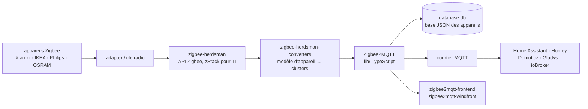

# Koenkk/zigbee2mqtt

> **Un pont logiciel qui expose des appareils Zigbee en MQTT, sans passerelle du fabricant.**

## Le problème

Chaque fabricant d'appareils Zigbee — Xiaomi, IKEA, Philips, OSRAM — impose sa propre
passerelle, son propre nuage et son propre protocole, ce qui enferme les capteurs et les
lampes dans des îlots qui ne se parlent pas et qui cessent de fonctionner le jour où le
service distant ferme.

## Ce que ça fait vraiment

Zigbee2MQTT parle directement à une clé radio Zigbee (« adapter ») branchée sur la machine, et
republie chaque événement d'appareil sur un courtier MQTT, dans les deux sens : on lit les
états et on envoie des commandes.

Le README décrit trois modules, développés chacun dans son propre dépôt :
`zigbee-herdsman` dialogue avec l'adaptateur et expose une API (pour le matériel Texas
Instruments, via l'API de supervision zStack) ; `zigbee-herdsman-converters` fait la
correspondance entre un modèle d'appareil précis et les clusters Zigbee qu'il gère ; le module
Zigbee2MQTT lui-même pilote herdsman et traduit les messages Zigbee en messages MQTT.

Il conserve l'état du système dans un fichier `database.db`, un fichier texte contenant une
base JSON des appareils connectés et de leurs capacités. Deux interfaces web sont fournies
pour la supervision et la configuration : `zigbee2mqtt-frontend` et `zigbee2mqtt-windfront`.

La liste des appareils pris en charge est tenue sur le site du projet ; le README indique qu'y
ajouter un modèle absent est « (fairly) easily » faisable, en suivant la procédure documentée.

## Comment c'est branché

Aucun diagramme tiré du code n'existe pour ce dépôt : ce schéma est reconstruit depuis le seul
README (section « Internal Architecture »).



## Essayer

Le README ne documente **aucune commande d'installation** : il renvoie le démarrage au site
`zigbee2mqtt.io` et, pour Home Assistant OS, à l'addon officiel `hassio-zigbee2mqtt`. Les
seules commandes présentes sont celles du cycle de développement :

```bash
pnpm install --include=dev
pnpm run build
pnpm run build:watch
pnpm run check:w
pnpm run test:coverage
```

## Coût et pièges

- **Le coût est matériel, pas logiciel** : il faut une clé radio Zigbee compatible. Le README
  ne cite explicitement que le cas Texas Instruments / zStack ; la liste du matériel supporté
  n'y figure pas.
- **Un courtier MQTT est un prérequis non fourni** : Zigbee2MQTT publie sur un broker qu'il
  faut installer et exploiter à côté.
- **Un état local à sauvegarder** : tout le réseau appairé vit dans `database.db`. Perdre ce
  fichier, c'est réappairer les appareils un par un.
- **Recompilation obligatoire** après toute modification de `lib/` (TypeScript), via
  `pnpm run build`.
- **Appareil non listé** = travail de conversion à faire soi-même, même si la procédure est
  documentée.
- Aucune clé d'API, aucun GPU, aucun quota, aucun compte à créer : rien de payant n'est
  mentionné dans le README, en dehors du lien de dons PayPal.

## Ce que ce n'est pas

- **Ce n'est pas un système domotique.** Il ne décide rien, n'a pas de moteur de règles et pas
  d'automatisations : il traduit du Zigbee en MQTT, la logique reste chez Home Assistant,
  Domoticz, ioBroker ou équivalent.
- **Ce n'est pas un service en nuage** : tout tourne chez soi, sur la machine qui porte la clé
  radio, ce qui est l'intérêt mais impose aussi d'en assurer la disponibilité, les sauvegardes
  et les mises à jour.
- **Ce n'est pas indépendant du matériel** : sans adaptateur Zigbee compatible, le projet ne
  fait rien, et la couverture d'un appareil dépend d'un convertisseur écrit pour son modèle.

## Alternatives

Aucune alternative comparable dans le catalogue : les voisins fournis (`avelino/awesome-go`,
`parallax/jsPDF`, `AtsushiSakai/PythonRobotics`, `JanDeDobbeleer/oh-my-posh`) n'ont aucun
rapport avec la domotique ni avec Zigbee. Les autres dépôts nommés dans le README ne sont pas
des concurrents mais des briques du même ensemble : `koenkk/zigbee-herdsman` (la couche Zigbee
brute, à préférer si l'on écrit son propre pont sans MQTT), `koenkk/zigbee-herdsman-converters`
(les définitions d'appareils, à préférer si l'on veut seulement contribuer un modèle) et
`zigbee2mqtt/hassio-zigbee2mqtt` (le même projet empaqueté en addon, à préférer sur
Home Assistant OS).

## Pour toi

Hors sujet pour un poste de travail data/IA, mais c'est la source de données la plus simple à
mettre en place pour un projet de séries temporelles domestiques : une fois branché sur un
broker MQTT, chaque capteur devient un flux d'événements horodatés qu'on peut ingérer sans
écrire un seul connecteur propriétaire. À adopter si l'on cherche un banc d'essai IoT réel ; à
ignorer sinon, puisque tout l'intérêt suppose du matériel Zigbee sur place.
