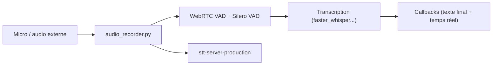

# KoljaB/RealtimeSTT

> Bibliothèque Python de reconnaissance vocale avec détection de voix, texte temps réel et mots d'éveil.

## Le problème
Brancher micro, détection de parole, transcription et rappels dans un assistant vocal demande beaucoup de colle.

## Ce que ça fait vraiment
`AudioToTextRecorder` capture le micro (ou des blocs PCM fournis), détecte la parole (WebRTC VAD puis Silero), transcrit avec `faster_whisper` par défaut, et rend texte final et texte temps réel via des rappels. D'autres moteurs sont proposés en extras (sherpa-onnx, Kroko, Moonshine, Parakeet…). Un serveur FastAPI de production (HTTP/WebSocket, authentification) est fourni en option. Wake words via Porcupine ou OpenWakeWord.

## Comment c'est branché


## Essayer
```bash
pip install "RealtimeSTT[faster-whisper]"
sudo apt-get install python3-dev portaudio19-dev
python -m pip install "RealtimeSTT[server,faster-whisper]"
stt-server-production --host 127.0.0.1 --port 8010
```

## Coût et pièges
Gratuit. PortAudio requis ; CI sur Python 3.11 et 3.12 seulement. Garde `if __name__ == "__main__":` (multiprocessing). Pour CPU, les modèles sherpa-onnx se téléchargent à part. Le serveur non-loopback exige jeton et TLS ; le moteur Kroko a des modèles commerciaux payants pour la production.

## Ce que ce n'est pas
Pas un modèle de reconnaissance : il orchestre des moteurs tiers, dont les licences diffèrent (voir `Engine licenses`).

## Alternatives
Aucune alternative nommée dans le README.

## Pour toi
À adopter : point de départ direct pour un assistant vocal ou un outil de dictée en Python, avec GPU ou CPU, à condition de vérifier la licence du moteur retenu.

